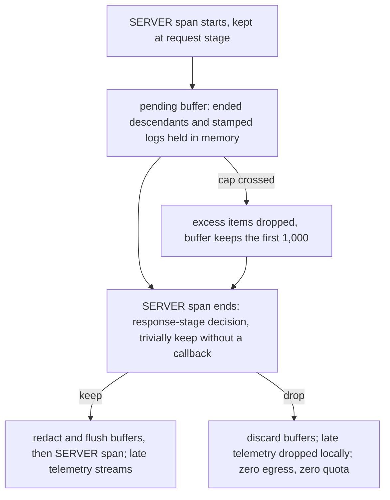
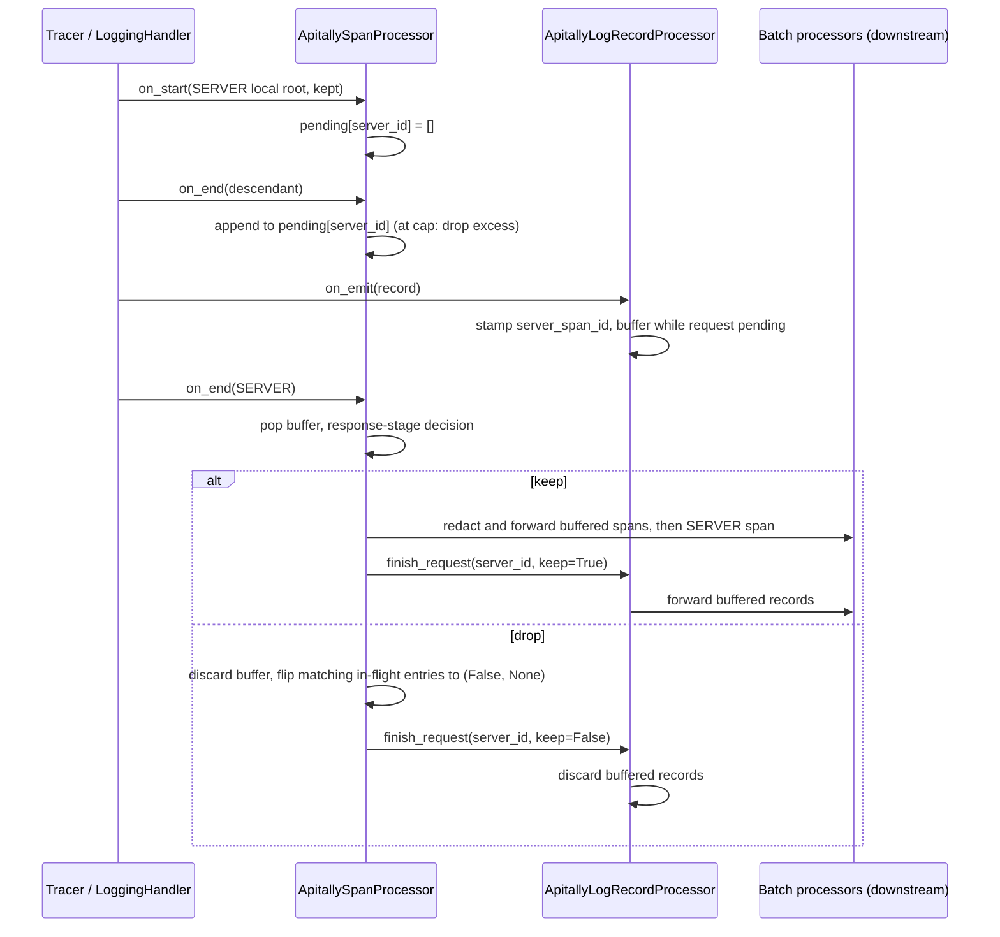

# Response-Stage Sampling Buffer - Plan

## Goal Capsule

- **Objective**: Hold every request's descendant spans and logs in memory until the SERVER span ends; the response-stage decision then flushes or discards them, so a sampled-out request exports nothing and consumes no quota. One pipeline behavior for all requests — no streaming mode. This delivers the follow-up named in `v1/sampling.md`'s Scope Boundaries (Sentry's transaction-envelope model as a holding layer in our processors) and removes the "stored unreachable, counted toward quota" caveat from `sample_on_response`.
- **Product authority**: This contract supersedes the orphan-egress behavior pinned by `v1/sampling.md` R6, AE2, and the U2 response-stage test scenarios, and the "cannot unsend mid-request telemetry" framing in `v1/design.md` §5. Everything else in the sampling plan and design docs stays authoritative, including the §3 single-drop-point architecture this slots into.
- **Stop conditions**: Surface a blocker instead of guessing if implementation would break the R6 unconditional zero-egress guarantee or force a Product Contract change beyond what this document describes.
- **Execution posture**: The "Code Style" and "Test posture" sections of `v1/plan.md` apply unchanged — least code that does the job, no new components beyond what the Key Decisions name, and tests that pin decisions rather than restate implementation.
- **Open blockers**: None.

---

## Product Contract

### Summary

The SDK buffers every kept request's ended descendant spans (in `ApitallySpanProcessor`) and stamped log records (in `ApitallyLogRecordProcessor`) keyed by SERVER span id. At SERVER span end the existing response-stage decision runs — trivially keep when no `sample_on_response` is configured; keep flushes the buffers downstream, drop discards them. Fixed per-request caps bound memory: at the cap, excess items are dropped (Sentry parity), so a dropped request exports nothing unconditionally and a kept request exports at most the caps. One behavior for every request in every mode.

### Problem Frame

The response-stage decision is inherently last: it needs the response, so it runs at SERVER `on_end`. But descendants and logs stream through the batch processors as they finish, so a response-stage drop leaves already-exported telemetry on the cloud side — stored unreachable per spec §6.5's orphan rule, yet counted against the user's quota. That makes `sample_on_response` a lever users pay for even when it drops, which undermines its purpose as a volume refinement. Sentry's SDKs solve this by holding the whole transaction in memory until the decision; the OTel equivalent is a holding layer in the wrappers we already own in front of the batch export.

### Key Decisions

- **KD1. Every request buffers — one pipeline behavior, no modes.** Buffering is not gated on `sample_on_response`; the response-stage decision at SERVER `on_end` is simply trivially keep when no callback is configured. Two facts make a conditional streaming fast path worthless: nothing about a request is reachable on the cloud side until its SERVER span arrives (the design.md §3 keystone), so holding telemetry until span end has zero user-visible latency; and streaming does not avoid retention — ended spans wait in the batch queue for up to its schedule delay anyway, so for typical requests buffering holds comparable memory for comparable time, and the caps bound the rest. One mode means the buffer is exercised by every request in every deployment rather than the minority that configure a response callback, one test matrix, and a uniform docs story ("a request's telemetry is exported when the request completes"). Accepted trade: the buffer is on the hot path for everyone, and long-running requests retain up to the caps.
- **KD2. Signal-local buffers with a decision notification.** Spans buffer in `ApitallySpanProcessor`, logs in `ApitallyLogRecordProcessor`, each keyed by SERVER span id. The span processor remains the sole decision authority and announces the per-request outcome to the log side, which already holds a span-processor reference for `resolve_server_span_id` — one new cross-wire, no new components. A unified envelope object was considered and rejected: it moves the same coupling into a log-sink back-reference and adds a grab-bag buffer type.
- **KD3. The buffering window is exactly the SERVER span's lifetime.** After the decision, a kept request's late telemetry (background-task spans, post-response logs) streams immediately as today; a dropped request's late telemetry is dropped locally — on drop, still-in-flight descendants' map entries flip to dropped so nothing leaks out after the fact.
- **KD4. Bounded by drop-excess caps, not configuration.** Fixed caps of 1,000 spans and 1,000 log records per request (Sentry parity — this is what Sentry's SDKs do at their transaction span cap). At the cap, that signal stops buffering and further items are dropped; the buffer flushes only at the decision. This keeps both product statements unconditional one-liners: a dropped request exports nothing, ever, and a kept request exports at most the caps. Long-lived requests (SSE, streaming responses) cap silently rather than degrade — the keystone makes mid-request delivery worthless anyway, since nothing is reachable server-side until the SERVER span arrives.
- **KD5. Pay at flush.** Redaction and downstream forwarding happen only when a buffer flushes (keep or overflow). A dropped request costs object retention for its duration and nothing else.
- **KD6. Shutdown discards pending buffers; force_flush leaves them pending.** An in-flight request's SERVER span can never export after shutdown, so its held telemetry is unreachable by construction — exporting it would recreate the exact quota waste this feature removes. Because buffering is universal, this also ends today's shutdown orphan egress for every user: descendants of in-flight requests no longer stream out just to die unreachable and quota-counted. `force_flush` flushes the downstreams but does not force a decision.
- **KD7. No spec or cloud-side change.** Spec §6.5's orphan rule stays as ingest robustness, now covering only the degradation paths: overflow, shutdown races, and out-of-order batch arrival.

### Requirements

**Buffering behavior**

- R1. Nothing of a pending request is exported before its response-stage decision: ended descendant spans and request-scoped log records are held in memory from SERVER span start to SERVER span end, for every request, whether or not `sample_on_response` is configured.
- R2. A response-stage drop discards the request's buffers and drops its late-arriving spans and logs locally: zero items exported, zero quota consumed.
- R3. A response-stage keep flushes buffered descendants (with the same redaction as the streaming path) and the SERVER span; exported content is identical to today's streaming output, only later.
- R4. Without `sample_on_response`, the response-stage decision is trivially keep: exported content is identical to today's, exported at SERVER span end rather than while the request runs.

**Bounds and degradation**

- R5. Per-request caps of 1,000 buffered spans and 1,000 buffered log records, fixed constants with no config surface. At the cap, that signal stops buffering: further spans or log records of that request are dropped locally. Per the design.md §9 quiet posture this is at most a DEBUG line, never a warning.
- R6. The zero-egress guarantee for dropped requests is unconditional: caps, shutdown, and late telemetry never cause a dropped request's items to export. Spec §6.5's orphan rule remains only for out-of-order batch arrival at ingest.

**Signal interactions**

- R7. Metrics are never buffered; histograms record at request end regardless of the pending state or eventual decision.
- R8. The startup event and other scope-`apitally` log records bypass the buffer, as they carry no request context.
- R9. `set_consumer`, `set_request_attribute`, and `capture_exception` work unchanged — they write to the live SERVER span, which exports or not at decision time.

**Lifecycle**

- R10. `shutdown()` discards pending buffers; `force_flush()` flushes downstream without deciding pending requests.
- R11. Fork-safety parity: buffers are plain data with no threads; the child-reset path clears them alongside the in-flight span map, and the before/after-fork downstream swap is unaffected.

**Docs**

- R12. `v1/design.md` §5 (`sample_on_response` row) is rewritten: response-stage drops export nothing and consume no quota, with the caps as the stated bound on kept requests. `v1/design.md` §3 gains the uniform export model — a request's telemetry is exported when the request completes. `v1/sampling.md` R6/AE2 and the Scope Boundaries entry gain a superseded-by note pointing here. README and migration guide state that `sample_on_response` is quota-safe, name the caps, and note that request-stage sampling remains the lever for skipping capture work (sampling.md R16 stands: bodies are still read and masked for requests dropped at response stage).

### Acceptance Examples

- AE1. **Covers R1, R2.** Given `sample_on_response` dropping healthy responses, when a 200 request with a DB child span and two log records completes, then the exporters receive zero items for that request.
- AE2. **Covers R3.** Given the same callback keeping 5xx, when a 500 request completes, then the child span, both log records, and the SERVER span are all exported with redaction applied — identical content to a run without buffering.
- AE3. **Covers R4.** Given no `sample_on_response`, when a request with a child span and a log record completes, then all items are exported with content identical to the pre-buffer pipeline's, and none reach the exporter before the SERVER span ends.
- AE4. **Covers R5, R6.** Given a request producing 1,001 descendant spans, when it is kept, then exactly 1,000 are exported; when it is dropped, none are.
- AE5. **Covers R2, KD3.** Given a background-task span that outlives the SERVER span, when the request is dropped at response stage, then the late span is dropped locally; when kept, it streams as today.
- AE6. **Covers R7, R9.** Given a response-stage-dropped request with `set_consumer` called, when metrics export, then the duration histogram counts the request with its consumer dimension.

### Scope Boundaries

- A conditional streaming fast path when `sample_on_response` is absent — considered and rejected (KD1); buffering is one behavior, not a mode.
- Overflow flush-and-stream (delivering telemetry beyond the caps by reverting that request to streaming) — considered and rejected: it reopens the orphan/quota caveat for dropped requests and adds a third per-request state; drop-excess keeps the guarantee unconditional.
- Config surface for the caps or an opt-out — fixed constants; revisit only on real-world evidence.
- Capture-work savings for response-stage drops — body buffering and mask callbacks still run (sampling.md R16); request-stage sampling remains the overhead lever. This feature removes egress and quota cost only.
- Cloud or spec changes — none required; §6.5 stands as written.

### Dependencies / Assumptions

- **Kept-flush race — accepted, not handled.** A background-thread span ending in the same instant as the SERVER span could append to a buffer being popped and flushed; the worst outcomes are one span lost from a kept request or one orphan span from a dropped one, in a nanosecond window. This is smaller than the batch-queue drops the OTel SDK already accepts silently, and the existing in-flight map carries the same class of unsynchronized access. No locking or ordering machinery may be added for it; the only nod is flushing pop-then-iterate, which makes most racing appends land in the flushed list for free.
- **Memory envelope.** Worst case is concurrent pending requests × cap × retained object size; buffered items are references to already-materialized `ReadableSpan` and log record objects, not copies. For typical requests this retention is comparable to what the batch queue already holds under its schedule delay; the delta is long-running requests, bounded by the caps. Acceptable without measurement.
- **Flush burstiness.** Flushing at request end hands the batch queue a request's spans as a burst rather than spread over the request's lifetime. At the default queue size this is immaterial; planning should note it, not tune for it.
- **Test supersession.** `tests/test_span_processor.py` scenarios that pin descendants forwarding before a response-stage drop (sampling.md U2) are rewritten to pin the buffer semantics instead.

---

## Planning Contract

Product Contract preservation: unchanged — R1–R12 and AE1–AE6 carried verbatim. One implementation note against R11: the in-flight span map was never actually cleared on fork-child re-activation (a pre-existing, harmless gap); U3 adds the clearing for map and buffers together, fulfilling R11's intent.

### Key Technical Decisions

- KTD1. **Pending buffers are plain dicts keyed by SERVER span id; entry existence is the pending state.** `ApitallySpanProcessor` gains `pending: dict[int, list[ReadableSpan]]`, created in `on_start` only for kept SERVER local roots; `ApitallyLogRecordProcessor` gains `pending: dict[int, list[ReadWriteLogRecord]]`, created lazily on the first buffered record. Every other code path is a membership miss: descendants of non-pending requests forward as today, and post-decision telemetry streams because the entry is gone. No mode flag anywhere (KD1).
- KTD2. **The decision hook is a settable attribute, fork-self-healing.** `ApitallySpanProcessor.on_request_finished: Callable[[int, bool], None] | None = None`; `ApitallyLogRecordProcessor.__init__` assigns its own `finish_request` to it — it already receives the span processor, so this is the KD2 one-line cross-wire. Fork-child re-activation constructs a new log processor against the inherited span processor, which re-assigns the hook; no stale reference can survive. Mirrors the existing settable-`downstream` pattern.
- KTD3. **Buffered log records are the stamped `ReadWriteLogRecord` objects, re-emitted via `downstream.on_emit` at flush.** Verified against opentelemetry-sdk 1.43.0: `BatchLogRecordProcessor.on_emit` reads only data fields (`log_record`, `resource`, `instrumentation_scope`, `limits`) and no ambient context, so deferred emission is legitimate. Stamping stays at emit time exactly as today; buffering happens after the stamp, gated on membership in `span_processor.pending`.
- KTD4. **Caps are module constants in house style**: `MAX_BUFFERED_SPANS = 1_000` in `apitally/shared/span_processor.py`, `MAX_BUFFERED_LOGS = 1_000` in `apitally/shared/log_processor.py` (pattern: `MAX_ATTRIBUTE_LENGTH`, `MAX_BODY_SIZE`). At the cap the append is skipped — a DEBUG line at most (R5); no counter, no state beyond list length.
- KTD5. **Flush is pop-then-iterate, no locks.** `pending.pop(...)` then forward each item. A racing append from a background-thread span either lands before the iterator passes the list end (exported) or falls into the accepted bounds in Dependencies. No locking or ordering machinery may be added.
- KTD6. **Drop propagation is one pass over the in-flight map.** On a response-stage drop, rewrite every `spans` entry whose server span id matches to `(False, None)`; late spans then drop at their own `on_end` and late logs fail `resolve_server_span_id`. No tombstones, no per-request child tracking.
- KTD7. **Redaction runs only at flush.** Buffered descendants are raw `ReadableSpan`s; `redact_span` applies per span as it forwards on the keep path, so dropped requests never pay redaction (KD5). Behavior-identical to today's redact-at-forward.
- KTD8. **Wrapper `shutdown()` clears pending before delegating; `force_flush` stays a pure delegate.** The only route to wrapper shutdown is provider atexit shutdown — exactly the KD6 case. The framework tests' post-request `force_flush()` calls stay correct because buffers are already flushed by the time they run.

### High-Level Technical Design

Cooperative mode composes without special cases: the user's other processors attach to the provider independently and receive spans on their own schedule; only Apitally's export path buffers. Metrics never flow through these processors (R7).

---

## Implementation Units

### U1. Span-side buffering in ApitallySpanProcessor

- **Goal:** Descendant spans of a kept request hold in `pending` until the SERVER span's response-stage decision; keep flushes them redacted, drop discards them and propagates to in-flight entries.
- **Requirements:** R1 (span half), R2, R3, R4, R5 (span cap), R6, R7, R9, R10.
- **Dependencies:** None.
- **Files:** `apitally/shared/span_processor.py`, `tests/test_span_processor.py`, `tests/test_asgi_transport.py`.
- **Approach:** Add `MAX_BUFFERED_SPANS` and `self.pending` (KTD1) plus the `on_request_finished` hook attribute defaulting to `None` (KTD2; U2 assigns it). In `on_start`, create `pending[span_id] = []` for kept SERVER local roots. In `on_end`, pop the map entry as `keep, server_id`; not-keep returns as today; the SERVER branch pops its buffer, runs `sample_response`, and on keep forwards each buffered span through `redact_span` followed by the SERVER span (KTD7), on drop flips matching in-flight entries (KTD6) — firing the hook with the verdict in both cases; a non-SERVER kept span appends to `pending[server_id]` when present (cap-guarded, KTD4) and forwards directly otherwise. `shutdown()` clears `pending` before delegating (KTD8). No locks (KTD5).
- **Patterns to follow:** existing `on_start`/`on_end` structure and never-raise wrappers in `apitally/shared/span_processor.py`; constants style per `apitally/shared/providers.py`.
- **Test scenarios:**
  - Covers AE1 (span half), R2. `sample_on_response` dropping healthy responses: a request with a child span exports zero spans.
  - Covers AE2, R3. The same callback keeping 5xx: child and SERVER span both exported, forwarded copies redacted, original spans unmutated (existing redaction pins stay green).
  - Covers AE3, R4. No `sample_on_response`: the exporter is empty while the SERVER span is still open (child already ended), and after SERVER end both spans are exported with today's content.
  - Covers AE4, R5, R6. A request with 1,001 children: kept exports exactly 1,000 children plus the SERVER span; dropped exports nothing.
  - Covers AE5, R2. A descendant ending after the SERVER span: exported when the request was kept, dropped locally when it was dropped (flipped entry).
  - Covers R10. `shutdown()` with a request still pending discards the buffer.
  - Covers AE6, R7, R9. Transport-level twin in `tests/test_asgi_transport.py` mirroring `test_sampled_out_request_still_records_metrics`: a response-stage-dropped request with `set_consumer` called exports no spans while the duration histogram counts it with its consumer dimension.
  - Rewrite `test_sample_on_response_keeps_errors_drops_healthy`: the healthy request's child is now discarded with it — only the error request's spans are exported; the spec §6.5 orphan comment goes.
  - Extend `test_server_root_and_child_kept`: after SERVER end, `spans` and `pending` are both empty.
- **Verification:** `tests/test_span_processor.py` and `tests/test_asgi_transport.py` green; kept requests' exported content unchanged from today, only later.

### U2. Log-side buffering in ApitallyLogRecordProcessor

- **Goal:** Stamped log records of a pending request hold until the decision; keep forwards them, drop discards them; scope-`apitally` records keep passing immediately.
- **Requirements:** R1 (log half), R2, R3, R5 (log cap), R8, R10.
- **Dependencies:** U1.
- **Files:** `apitally/shared/log_processor.py`, `tests/test_logs.py`.
- **Approach:** Add `MAX_BUFFERED_LOGS` and `self.pending` (KTD1, KTD4). `__init__` assigns `finish_request` to `span_processor.on_request_finished` (KTD2). In `on_emit`, after the existing resolve-and-stamp, buffer the record instead of forwarding when the server span id is in `span_processor.pending` (KTD3); the `server_span_id is None` paths (drop, or `apitally` scope pass-through) are untouched. `finish_request(server_span_id, keep)` pops its buffer and forwards each record on keep. `shutdown()` clears `pending` before delegating (KTD8).
- **Patterns to follow:** existing stamp-or-drop structure and never-raise wrapper in `apitally/shared/log_processor.py`.
- **Test scenarios:**
  - Covers AE1 (log half), R2. A response-stage-dropped request's log records are never exported.
  - Covers AE2, R1, R3. A kept request's records export at SERVER end with the existing stamping intact — and the exporter is empty before the SERVER span ends (existing `test_log_in_nested_span_carries_server_span_id` extended with the mid-request emptiness assertion).
  - Covers R8. The `apitally`-scope startup record exports immediately with no request (existing test stays green).
  - Covers R5. A request emitting `MAX_BUFFERED_LOGS + 1` records: kept exports exactly the cap.
- **Verification:** `tests/test_logs.py` green including the existing stamping, scope, and exclusion pins.

### U3. Fork-child hygiene: clear inherited processor state

- **Goal:** A forked child reusing the inherited span-processor wrapper starts with empty in-flight and pending state.
- **Requirements:** R11.
- **Dependencies:** U1.
- **Files:** `apitally/shared/activation.py`, `tests/test_fork.py`.
- **Approach:** In `start_pipelines`' inherited-wrapper branch, clear `spans` and `pending` on the inherited span processor before swapping in the fresh downstream. The map was never cleared here before — a pre-existing harmless gap that buffering would amplify into retained span objects. The log side needs nothing: the child constructs a fresh `ApitallyLogRecordProcessor` (empty pending, hook re-assigned per KTD2).
- **Test scenarios:**
  - Covers R11. After simulated child re-activation, the reused span processor has empty `spans` and `pending`.
- **Verification:** `tests/test_fork.py` green.

### U4. Docs: design doc, sampling plan, README, migration guide

- **Goal:** User-facing and internal docs state the uniform export-at-request-end model and the now-unconditional quota guarantee.
- **Requirements:** R12.
- **Dependencies:** U1–U3 (documents the final shape).
- **Files:** `README.md`, `MIGRATION.md`, `v1/design.md`, `v1/sampling.md`.
- **Approach:** Per R12 — `v1/design.md` §5 `sample_on_response` row rewritten (drops export nothing and consume no quota; caps as the bound on kept requests) and §3 gains the uniform export model; `v1/sampling.md` R6/AE2 and the Scope Boundaries buffering entry gain superseded-by notes pointing to `v1/buffering.md`; README and MIGRATION state that `sample_on_response` is quota-safe, name the caps, and keep request-stage sampling as the capture-work lever (sampling.md R16 stands).
- **Test scenarios:** Test expectation: none — documentation.
- **Verification:** No stale "counts toward quota" claims about response-stage sampling remain in `v1/design.md` or user-facing docs; superseded notes present in `v1/sampling.md`.

---

## Verification Contract

| Gate | Command | Applies to |
|---|---|---|
| Test suite | `make test` (`uv run pytest -v --tb=short`) | U1–U3 |
| Lint, format, types, lockfile | `make check` (ruff check, ruff format --diff, ty check, `uv lock --locked`) | All units |
| Coverage | `make test-coverage` | CI |
| Framework matrix | CI workflow (`.github/workflows/tests.yaml`) per-framework jobs | U1–U3 (no adapter changes; matrix must stay green) |

The new tests named in U1–U3 are the proof: the buffer-timing assertions, the drop-discards-everything pins, the cap tests against the real constants, the late-span flip test, and the transport-level metrics twin.

---

## Definition of Done

- R1–R12 implemented and traced through U1–U4; AE1–AE6 realized as the deterministic tests named in the units.
- The diff holds `v1/plan.md`'s Code Style and Test posture: every new test pins a spec MUST, a design decision, or a real regression risk — no padding.
- No locks, ordering machinery, or mode flags introduced — KD1 and KTD5 hold in the diff.
- Exactly one legacy test rewritten (`test_sample_on_response_keeps_errors_drops_healthy`); all other existing tests pass unmodified except the named assertion extensions.
- `make test` and `make check` pass locally; the CI framework matrix is green.
- `README.md`, `MIGRATION.md`, `v1/design.md`, and `v1/sampling.md` updated per U4.

---

## Sources

- `v1/sampling.md` R6, AE2, Scope Boundaries (the deferred holding layer), R16.
- `v1/design.md` §3 (single drop point, keystone/orphan framing), §5 (`sample_on_response` quota caveat), §7 (fork swap mechanics), §9 (logging posture).
- `v1/spec.md` §6.5 (orphan rule: "An SDK dropping a SERVER span at response time ... MAY rely on this to abandon telemetry the request already emitted").
- `apitally/shared/span_processor.py` (in-flight map, two-stage decision, redact-and-forward copy), `apitally/shared/log_processor.py` (stamp-or-drop, span-processor reference), `apitally/shared/activation.py` (downstream construction, fork swaps, `inherited_span_processor` reuse in `start_pipelines`, `reset()`).
- opentelemetry-sdk 1.43.0 `opentelemetry/sdk/_logs/_internal/` — `LogRecordProcessor.on_emit(ReadWriteLogRecord)` signature; `ReadWriteLogRecord` as a plain data holder; `BatchLogRecordProcessor.on_emit` reading only data fields, sanctioning deferred re-emission (KTD3).
- `tests/test_span_processor.py` (fixtures: `SimpleSpanProcessor(InMemorySpanExporter)` downstream, `remote_parent_context`, post-configure `create_tracer`; `test_sample_on_response_keeps_errors_drops_healthy` as the single test pinning the old orphan-forward behavior), `tests/test_logs.py` (no-op span downstream, `SimpleLogRecordProcessor`, scope-`apitally` pass test), `tests/conftest.py` (config/providers/activation reset fixtures), `tests/test_fork.py` (`downstream.force_flush` call sites).
- Prior art: Sentry SDK transaction envelopes (hold-until-finish, ~1,000-span cap per transaction with excess dropped).
