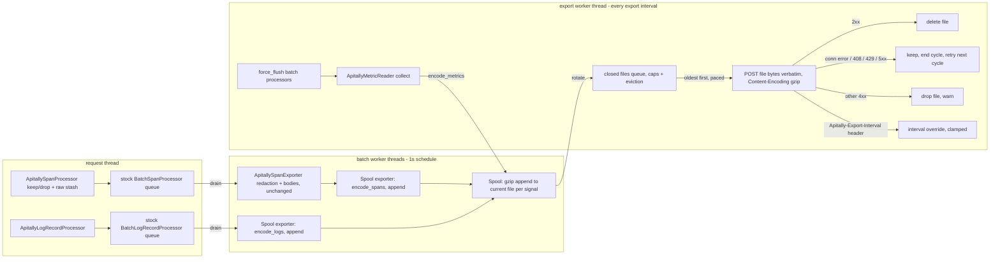

# feat: Disk-backed write-through spool for OTLP export (downtime resilience)

Created: 2026-07-12. Updated for the post-#320 base and for the decision to retain the stock batch processors as the intake layer. Plan depth: Deep. Origin: grill session in this conversation (all decisions below were aligned with Simon or explicitly resolved during design).

---

## Context

The v1 rewrite delegates OTLP export entirely to the stock OpenTelemetry batch processors and HTTP exporters. During an Apitally endpoint outage those absorb only ~10 seconds of failure per batch before dropping data. The 0.x SDK buffered aggregated sync payloads in memory for up to an hour and request logs in gzip temp files on disk (up to ~50MB), retrying every sync cycle. That resilience was repeatedly valuable in production and must be restored.

The stock batch processors stay exactly where they are; what changes is what their exporters do and how bytes reach Apitally. The exporter delegate behind `ApitallySpanExporter` becomes a spool-writing exporter instead of the network exporter, turning the batch processors into a fast path to disk, and a single export worker thread sends spool files to the OTLP endpoint on a fixed interval:

- Ended spans and log records leave RAM within ~1s: the retained batch processors (schedule delay lowered to 1s) drain them on their worker threads through the existing redaction exporter, and the new delegate serializes to protobuf and gzip-appends to temp files on disk. The in-memory queues become a short pass-through buffer; disk is the retry buffer.
- The export worker rotates each signal's current spool file (0.x `rotate_file` pattern: close it, queue it for sending, start a new one) and sends the closed files every 15s (server-adjustable), streaming file bytes verbatim as the POST body. It also drives metric collection, so all three signals export in lockstep.
- A failed send leaves the file queued for the next cycle. Outage handling is the same code path as normal operation, exercised every cycle, so it cannot rot.

Base after PR #320: the keep/drop span processor stashes raw headers and bodies on exported SERVER span snapshots (`STASH_ATTRIBUTE` / `RequestStash` in `apitally/shared/span_processor.py`), and `ApitallySpanExporter` (`apitally/shared/exporter.py`) applies all redaction, mask callbacks, and body attribute injection on the export thread, wrapping a delegate `SpanExporter`. This plan reuses `ApitallySpanExporter` unchanged and swaps its delegate from the OTLP exporter to the spool-writing exporter. Two consequences: redaction runs before any bytes are written, so spool files only ever contain redacted data; and raw stashed bodies, which today sit in the batch processor's queue for up to 5s until export, leave RAM within ~1s.

Backend investigation (apitally_cloud) confirmed feasibility: the OTLP ingest has no freshness validation and buckets all three signals by payload timestamps, so hour-late replay backfills correctly; the NATS JetStream dedup (content hash of the compressed body, 1h window) absorbs duplicate re-sends as long as replays are byte-identical and within 1 hour, which the design guarantees by capping each file's send eligibility at 59 minutes after its first send attempt (checked immediately before each POST, so the final retry's own transit and timeout still land inside the server's window) and sending stored bytes verbatim. Payload size is bounded on two layers: the receiver publishes the compressed body verbatim to NATS, whose production max_payload is 8MB (infrastructure helmfile; local docker-compose runs the 1 MiB NATS default), and the ingester silently drops payloads over 16 MiB decompressed.

Secondary wins: client memory footprint shrinks (span/log queues hold data for ~1s instead of being the multi-second retry buffer, which post-#320 also means raw request/response bodies leave RAM faster), request volume to the cloud drops (~73 requests/min/process worst case today down to a few per cycle), and ClickHouse gets larger insert batches.

Prior art (researched 2026-07-12): no reusable component exists. opentelemetry-python core and contrib have no disk-backed buffering or persistent export queue, and no open issue asking for one; the spec acknowledges the gap (opentelemetry-specification#3645, accepted but unsponsored and unimplemented). The Java contrib disk-buffering module and Swift PersistenceExporter exist but re-encode telemetry on replay, which alone disqualifies their pattern for the byte-identical dedup contract. The closest architectural cousins validate this design instead: .NET's experimental OTLP disk retry stores serialized request bytes and replays them verbatim, and pydantic/logfire privately built the same pattern (`logfire/_internal/exporters/otlp.py`, `DiskRetryer`: temp files holding final request bytes, daemon-thread replay, size cap) because nothing reusable existed. Generic durable-queue libraries (persist-queue, litequeue, diskcache) cannot append into a growing gzip stream or send a file verbatim, so they would add a dependency and SQLite fork hazards while all spool logic would still need to be written.

---

## Requirements

- R1: Telemetry (spans, logs, metrics) survives Apitally OTLP endpoint downtime of at least 1 hour and is delivered after recovery, filed at original event time. Longer outages lose only files whose 59-minute retry window expired (roughly one file per outage hour, see R7); data never attempted survives within the size caps regardless of outage duration.
- R2: SDK memory footprint must stay small and hard-bounded at all times; request/response detail must not accumulate in RAM (disk is the buffer).
- R3: No duplicate serialization or compression anywhere: serialize protobuf once, gzip once (streaming to disk), send file bytes verbatim. Replay bytes must be identical across retries (server dedup relies on it).
- R4: All three signals export together in the same cycle so the dashboard never shows metrics/logs/spans from inconsistent time windows.
- R5: Export interval defaults to 15s, with an early first export after activation (startup event and first requests appear fast for new users), and the server can override the interval via the `Apitally-Export-Interval` response header.
- R6: Writable filesystem is probed at activation; without one, the same spool machinery falls back to in-memory buffers with a small hard cap and a single warning.
- R7: Retention: a file expires 59 minutes after its first send attempt, because any attempt might have published to NATS with the response lost, and re-sending the same bytes after the server's 1h dedup window would double-ingest; the horizon sits one minute under the window so the last permitted retry (checked immediately before each POST) still lands strictly inside it despite transit time and the 10s timeout. Never-attempted files carry no such risk and do not age out. Max spool size 50MB compressed on disk / 10MB in memory; oldest closed files evicted first; metrics files exempt from size eviction (only the retry-window expiry applies to them).
- R8: Zero new user-facing config. Spool dir is the system temp dir (honors TMPDIR). Interval is controlled only by the default and the server header.
- R9: Failure classification: connection errors, timeouts, 408, 429 and 5xx are retryable (file kept); other 4xx (including 402 quota and 401/403 auth) are permanent (file dropped). Warnings only for actual data loss, per SDK minimal-logging policy.
- R10: Sent payloads must respect both backend size limits: the ingester's 16 MiB decompressed cap (silent drop) and the NATS max_payload of 8MB on the compressed body (publish failure, which the SDK would see as a retryable 503 and retry until age-out). Rotation at 4 MB uncompressed bytes written, enforced as a rotate-before-append fit check combined with bounded sub-batch encoding and capped per-record inputs (U2), keeps every closed file under the threshold even for incompressible content where gzip achieves no reduction. The caps: span bodies max 50 KB (capture layer plus the exporter's mask-callback re-check), span attribute values max 64 KB (SpanLimits; stash-injected header values are bounded in practice by web server header limits), and log record bodies and attribute values truncated to 2048 characters at encode time (U2, the server's log message contract), since nothing upstream bounds a log record body.
- R11: Fork safety on par with current v1: parent quiesces and resumes with its spool intact; forked child starts with fresh spool state on its own activation.
- R12: All redaction and body processing (the `ApitallySpanExporter` pass) happens before payload bytes are written to the spool; unredacted data never touches disk.

---

## Key Technical Decisions

| Decision | Rationale |
|---|---|
| Retain the stock batch processors as the intake layer; only their exporter delegate changes, from network to spool | Inherits battle-tested queueing, wakeup-on-burst, drop accounting, force_flush/shutdown semantics, fork reinit, and instrumentation suppression instead of reimplementing them; `activation.py` wiring, fork choreography, and test fixtures stay nearly unchanged. Schedule delay set to 1s so telemetry reaches disk fast |
| Write-through spool replaces the network exporters as the retry mechanism | Resilience path == normal path (always exercised); disk, not RAM, absorbs outages; 24x fewer requests; direct port of the proven 0.x request logger shape |
| Reuse `ApitallySpanExporter` unchanged, delegate swapped to the spool-writing exporter | The #320 redaction wrapper already targets the standard `SpanExporter` interface with a delegate; pointing the delegate at the spool keeps all redaction/body logic and its contract tests intact, and satisfies R12 by construction |
| Append serialized `Export*ServiceRequest` messages to one gzip stream per spool file | Protobuf concatenation of same-type messages merges repeated fields, so a closed file read verbatim is one valid OTLP request. Single gzip stream keeps the compression dictionary across micro-batches (better ratio than per-batch gzip) |
| Send file bytes verbatim, retry the same bytes | Backend NATS dedup keys on a content hash of the compressed body with a 1h window; byte-identical replay within 1h makes delivery effectively exactly-once for the lost-response case. This is also why files are never merged or re-encoded for replay |
| File expiry 59 minutes after first send attempt (re-checked immediately before each POST), uniform across signals; never-attempted files kept regardless of age | The expiry clock is anchored to the actual risk: an attempted file might have been published with the response lost, so re-sending after the 1h dedup window could double-ingest (0.x had the same window via client UUIDs as Nats-Msg-Id; verified in hub.py and messages.py, with no durable dedup layer behind it -- ClickHouse tables are plain MergeTree). The horizon sits one minute under the server window because the two clocks differ: the window opens when the first publish reaches NATS, the client clock starts at POST initiation, and the final retry's own transit and timeout must still land inside the window. A never-attempted file has provably never been published, so it can wait out any outage. During an outage only the probed oldest file has a running clock, so loss is bounded to roughly one file per outage hour and everything else delivers at recovery |
| One export worker thread drives sending and metric collection | Calling the metric reader's collect() from the export cycle (instead of a periodic timer thread) makes signal lockstep structural (R4); the worker replaces the stock metric timer thread, so total thread count stays at three. Delta temporality makes collect-on-export correct at any cadence; the backend sums sub-minute deltas into the right minute bucket |
| Flat 15s interval + `Apitally-Export-Interval` response header override + early first export | Replaces the 0.x two-interval hack. Server-side policy (new-app fast mode, live-dashboard fast mode) comes later without SDK releases; header parsing is trivial since we own the HTTP calls. "Export interval" is the stock OTel term (PeriodicExportingMetricReader's export_interval_millis) |
| requests + opentelemetry-exporter-otlp-proto-common replace opentelemetry-exporter-otlp-proto-http | We only need the protobuf encoders (encode_spans/logs/metrics) and plain HTTP POSTs. Dropping proto-http removes dependence on its private retry internals entirely |
| Memory fallback is the same spool with a different byte sink | One small backing class, not a second pipeline. Caps: 10MB, drop-oldest, warn once at activation |
| Metrics exempt from size eviction | A full hour of metric payloads is a few hundred KB; exempting them structurally guarantees the aggregate data (the primary outage-survival value) survives the hour while span/log files churn under the 50MB cap |
| Thundering-herd protection: rotate on demand, per-cycle send cap (~10 files), jittered sleeps between sends, +/-10% jitter on the export interval | Rotate-on-demand (rotate at the 4 MB threshold, or at export time only when the signal has no closed files waiting) means an outage produces few large files instead of one tiny file per cycle, shrinking the recovery burst by an order of magnitude; the cap spreads a full backlog over ~5+ cycles; interval jitter desynchronizes fleets whose processes started together in a deploy; 429-as-retryable remains the server-driven backstop. During an outage the SDK sends exactly one probe POST per cycle (oldest file first, cycle ends on first retryable failure), which is less traffic than healthy operation |

Decisions resolved during design (recorded, not open): rotation threshold is 4 MB uncompressed, tracked as a single counter (worst-case compressed size then stays at ~4 MB, half the prod NATS max_payload, avoiding a poison file that could never be published and would retry until age-out; 4x margin under the ingester's 16 MiB decompressed cap; typical compressed size ~0.5 MB keeps POSTs fast on slow uplinks within the 10s timeout); at-least-once delivery accepted within the dedup window; non-retryable 4xx drops the file; orphaned spool files from crashed processes are best-effort cleaned up at activation (mtime older than 2h; live processes shield their files by touching them every export cycle); shutdown performs a final drain-and-send attempt with a short timeout (0.x parity); gzip compression is now always on (v1 currently exports uncompressed, so this is also a happy-path bandwidth win); startup event needs no special handling (it flows through the log pipeline into the spool and lands with the early first export); log record bodies and attribute values are truncated to 2048 characters at encode time (0.x parity and the server's log message contract; nothing upstream bounds a log body, and an unbounded record would break the 4 MB file bound, see R10/U2).

### Practices carried over from the stock OTel implementation

Reviewed the installed opentelemetry-python 1.43 sources. The split below follows the architecture: the shared `BatchProcessor` (`sdk/_shared_internal/__init__.py`) stays in the pipeline, so its practices come along automatically; the proto-http `OTLPSpanExporter` is removed (U6), so the practices worth keeping from it are implemented by hand in the export worker.

Inherited for free by retaining the batch processors as intake: instrumentation suppression around the drain/redaction/spool-write path (`_SUPPRESS_INSTRUMENTATION_KEY`), queue-full drop warnings dampened by a `DuplicateFilter`, wakeup-on-burst when the queue crosses the batch threshold, `force_flush`/`shutdown` semantics with a timeout budget, and fork reinit via `os.register_at_fork` with a weakref.

To implement by hand in the export worker, following the stock patterns:

- Instrumentation suppression: hold `_SUPPRESS_INSTRUMENTATION_KEY` around metric collection, rotation, and HTTP sends, so our own POSTs (via requests) never generate spans that feed back into the pipeline (all instrumentations honor it via `is_instrumentation_enabled()`).
- Rate-limited internal logging: a `DuplicateFilter`-style dampener on export-path loggers so a failing endpoint cannot log endlessly; this also bounds the feedback of our own warnings into the captured-logs pipeline.
- Retry classification: stock treats 408 and all 5xx as retryable plus ConnectionError; the OTLP spec additionally lists 429 (stock Python omits it, arguably a gap). We follow the spec: connection errors, timeouts, 408, 429, 5xx retryable; everything else permanent.
- Immediate single re-POST on ConnectionError: stock retries the POST once inline because servers may close idle keep-alive connections mid-request. With a 15s cycle this matters more for us (a stale-connection failure would otherwise delay a file a full cycle).
- Shutdown discipline: a timeout budget (stock default 30s), a flag that makes further work no-ops, all sleeps as `Event.wait(...)` so shutdown wakes the worker immediately, join with the remaining budget.
- Jitter to avoid fleet-wide synchronization: stock applies +/-20% to its retry backoff sleeps; our design has no backoff (a failed file simply waits for the next cycle), so the jitter lands on our two pacing sites instead -- the +/-10% on the export interval and the short sleeps between sends.
- Named daemon thread (stock: `OtelBatchSpanRecordProcessor`); ours gets a clear `Apitally...` name for thread dumps.
- Explicit User-Agent: stock sends `OTel-OTLP-Exporter-Python/<version>`; we send `apitally-py/<version>`.

---

## High-Level Technical Design

Directional sketch, not implementation specification.

Spool file lifecycle: open (gzip writer over a byte sink) -> append serialized protobuf micro-batches -> rotate (close the gzip stream, queue the file for sending, start a new one; 0.x `rotate_file`) when 4 MB uncompressed has been written, or at export time if the signal has no closed files waiting -> send -> delete on 2xx or age/size eviction. In healthy operation the queue is empty every cycle, so rotation happens every 15s; during an outage the current file keeps growing toward the size threshold instead of producing one tiny file per cycle. The byte sink is a temp file (default) or an in-memory buffer (fallback); everything above the sink is identical. Appends come from the two batch worker threads and the export worker (metrics), so append/rotate is guarded by a small lock.

Export cycle: force_flush both batch processors (so everything recorded before the cycle reaches the spool), collect metrics, rotate current files where due, send closed files oldest-first (capped per cycle, jittered sleeps between sends). Only the spool-writing exporters and the export worker are new code; the intake layer is the stock batch processors unchanged.

Threads after this change: the two stock batch worker threads (retained) and the Apitally export worker, which replaces the stock metric reader timer thread. Three total, same as today.

---

## Implementation Units

### U1. Spool storage: files, backings, caps, eviction

**Goal:** A `Spool` that accepts serialized payload bytes per signal and manages file lifecycle (append, rotate, send-ordering, delete), the caps and eviction, the writable-filesystem probe, the memory fallback, and orphan cleanup. Thread-safe: appends come from the batch worker threads, rotation from the export worker.

**Requirements:** R2, R3, R6, R7, R10.

**Dependencies:** none.

**Files:** `apitally/shared/spool.py` (new), `tests/shared/test_spool.py` (new).

**Approach:** Spool file = gzip writer over a byte-sink backing (file backing: `tempfile.NamedTemporaryFile(prefix="apitally-", suffix=".gz", delete=False)` like 0.x `TempGzipFile`; memory backing: BytesIO). A lock guards append/rotate per signal. Track uncompressed bytes written per file; `append` rotates the current file first whenever the bytes already written plus the incoming payload would cross 4 MB (fit check, so no closed file ever exceeds the threshold; backend size limits, R10). The spool also rotates at export time, but only when the signal has no closed files waiting (rotate-on-demand: during a send backlog the current file keeps growing instead of adding one file per cycle). Closed files carry signal + creation time + compressed size + first-attempt timestamp (None until the export worker first POSTs the file). Eviction on every append/rotate: delete files whose first send attempt lies more than 59 minutes back (send horizon, R7); the export worker re-checks the same horizon immediately before each POST (U3); never-attempted files do not age out. While total compressed size exceeds the cap (50MB disk / 10MB memory), delete the oldest closed non-metrics file. Writable probe at construction (port 0.x `_check_writable_fs`); on failure, warn once and use memory backings. Write failures after activation (e.g. ENOSPC) get the simplest handling that avoids silent loss: an OSError during append or rotate discards the current file (its truncated gzip stream is unsalvageable and would otherwise be 2xx'd by the receiver and dropped at decompression), warning once per episode via the rate-limited logger; the next append opens a fresh file. An OSError while reading a file for a send drops that file the same way, so an unreadable file cannot block the queue. Best-effort deletion of `apitally-*.gz` files in the spool dir with mtime older than 2h at construction. Live processes protect their files from sibling sweeps through a liveness touch: the export worker `os.utime`s every spool file it holds once per cycle (U3), so the 2h threshold only catches files whose owner stopped cycling (crashed or stalled processes whose files would never be sent anyway). The spool retains open file objects for sending (0.x `TempGzipFile` pattern), so even a mis-timed sweep by a sibling cannot break an in-flight send. Constants module-level, no config. The spool never deletes files from a finalizer (no `__del__`-based cleanup): only explicit eviction, a successful send, and the test-only teardown delete files. This rule is what makes it safe for a forked child to abandon an inherited spool object (U5).

**Patterns to follow:** 0.x `TempGzipFile`, `RequestLogger.rotate_file`, and `RequestLogger.maintain` in `git show main:apitally/client/request_logging.py`; module/comment conventions of `apitally/shared/`.

**Test scenarios:**
- Appending two serialized `ExportTraceServiceRequest` payloads to a spool file, rotating, gunzipping and parsing yields one merged request containing both payloads' resource_spans (proves R3's concatenation property end to end).
- Closed file bytes are stable: reading the file twice returns identical bytes.
- An append that would push uncompressed written bytes past the 4 MB threshold rotates first and lands in a fresh file, so no closed file's decompressed size exceeds the threshold.
- Export-time rotation only happens when the signal has no closed files waiting; with a backlog present, appends keep going to the current file.
- A file whose first send attempt lies more than 59 minutes back is deleted on the next maintenance pass, including metrics files; a never-attempted file of any age survives.
- When total size exceeds the cap, oldest non-metrics files are deleted first and metrics files survive.
- Memory backing passes the same append/rotate/read/evict scenarios (parametrize backings where practical).
- Failed writability probe falls back to memory backing and logs exactly one warning.
- An append that raises OSError discards the current file with a single warning; the next append starts a fresh file.
- Orphan cleanup deletes a stale `apitally-*.gz` file older than 2h and leaves a fresh one alone.
- The liveness touch refreshes mtimes: after touching, a sweep with the 2h threshold leaves the files in place.

**Verification:** `uv run pytest tests/shared/test_spool.py` green; a closed file gunzips with the `gzip` CLI as a sanity check.

### U2. Spool-writing exporters behind the retained batch processors

**Goal:** A spool-writing exporter that encodes batches (`encode_spans` / `encode_logs` from opentelemetry-exporter-otlp-proto-common) and appends to the spool, satisfying the `SpanExporter` and `LogRecordExporter` interfaces (one generic implementation parameterized by encoder and signal; how the two interfaces are satisfied is implementer's call). The stock `BatchSpanProcessor` / `BatchLogRecordProcessor` are retained as intake with all four constructor parameters passed explicitly (`schedule_delay_millis=1000`, the other three at their stock defaults), because the stock constructors fall back to `OTEL_BSP_*` / `OTEL_BLRP_*` env vars for any parameter left as None, and this private pipeline must not be tuned by env vars aimed at the user's own exporters (same pattern and rationale as `setup_tracer_provider` in `apitally/shared/providers.py`); spans drain through the existing `ApitallySpanExporter` wrapping the spool exporter, so all redaction and body processing happens on the batch worker thread before bytes reach the spool (R12), exactly as the export call works today.

**Requirements:** R2, R3, R12.

**Dependencies:** U1.

**Files:** `apitally/shared/export.py` (new, spool exporters + export worker live together), `tests/shared/test_export.py` (new).

**Approach:** The exporter encodes and appends in bounded sub-batches: `export(batch)` splits the drained batch into chunks of at most 32 spans or log records, encodes each chunk via proto-common, and calls `spool.append(signal, bytes)` per chunk (protobuf concatenation makes several small requests in one file exactly as valid as one big one). Log records are truncated before encoding: body strings and attribute values longer than a 2048-character module constant are cut, the direct port of 0.x `MAX_LOG_MSG_LENGTH` and the server's log message contract (the backend validates messages at max_length=2048, so longer bodies are dead bytes on the wire). This closes the one unbounded per-record input: the OTel `LoggingHandler` sets body = `record.getMessage()` verbatim and `LoggerProvider` accepts no limits, so a single `logger.info(huge_string)` would otherwise produce an unsplittable oversized chunk whose file could never publish (NATS max_payload) and would poison-retry until age-out. With every per-record input capped (span bodies 50 KB, span attribute values 64 KB, log bodies and attribute values 2048 characters), a worst-case 32-record chunk stays well under 4 MB, so together with the spool's rotate-before-append fit check (U1) every closed file stays under the threshold regardless of batch processor tuning. The sub-batch size and truncation cap are module constants like the other caps. `force_flush` returns True (nothing buffered); `shutdown` is a no-op toward the spool (lifecycle owned by activation). The downstream-swap contract in `apitally/shared/activation.py` (`span_processor.downstream = ...`) is untouched because the downstream is still a stock batch processor; existing tests keep substituting in-memory downstreams. Queue overflow, drop warnings, suppression, and fork reinit are stock batch processor behavior, not ours to reimplement.

**Patterns to follow:** `ApitallySpanExporter` delegate wiring in `apitally/shared/exporter.py` and `create_batch_span_processor` in `apitally/shared/activation.py`.

**Test scenarios:**
- A span batch exported through `ApitallySpanExporter(spool exporter)` appears in the spool as a parseable encoded payload with the expected span names and resource.
- A span carrying a stashed raw body and sensitive headers ends up in the spool redacted: the gunzipped payload contains the masked values and never the raw secret bytes (R12).
- A log batch exported through the spool exporter appears in the spool as a parseable encoded payload.
- A batch larger than the sub-batch size is appended as multiple payloads; the gunzipped file parses to the full span set with none lost or duplicated.
- A log record with a body larger than the truncation cap lands in the spool with the body cut to the cap; the encoded payload parses and the record's other fields are intact.

**Verification:** `uv run pytest tests/shared/test_export.py` green; `tests/shared/test_exporter.py` (the #320 redaction contract tests) stays green untouched.

### U3. Export worker: cycle, HTTP, retry, interval override

**Goal:** The background thread that runs every export interval: force_flush the batch processors, collect metrics, rotate current spool files, send closed files oldest-first; handles failures per R9 and the interval header per R5.

**Requirements:** R1, R3, R4, R5, R9.

**Dependencies:** U1, U2, U4 (metric collection hook).

**Files:** `apitally/shared/export.py`, `tests/shared/test_export.py`.

**Approach:** Port the 0.x `client_threading.ApitallyClient` loop shape (daemon thread with a clear name, stop Event interrupting all sleeps, atexit-registered shutdown with a timeout budget and final drain-and-send). The worker stores no references to the batch processors or the metric reader; each cycle resolves them through the stable identities (`span_processor.downstream`, `log_processor.downstream`, `metrics.reader`), which the fork handlers repoint to fresh instances (U5) -- construction-time references would silently target shut-down processors and the detached old reader after the first fork. Export cycle, with the suppress-instrumentation context key held throughout: force_flush the span and log batch processors, call the metric reader's `collect()`, rotate current spool files where due (rotate-on-demand rule, U1), touch all held spool files as a liveness marker (orphan-sweep protection, U1), then POST closed files oldest-first with a per-cycle cap (~10) and short jittered sleeps between sends (0.x pacing). Immediately before each POST the worker re-checks the send horizon and evicts instead of sending when the file's first attempt lies more than 59 minutes back, so the last permitted retry lands strictly inside the server's 1h dedup window regardless of queue wait, transit, or timeout. The wait between cycles carries +/-10% jitter so fleets whose processes started together in a deploy drift apart instead of bursting in phase. POST via a `requests.Session`: URL from config `otlp_endpoint` + `/v1/{traces,logs,metrics}`, headers Authorization Bearer + `Apitally-Env` (reuse `providers.export_headers` / `providers.endpoint_url`, relocated or imported), `Content-Type: application/x-protobuf`, `Content-Encoding: gzip`, `User-Agent: apitally-py/<version>`, body streamed from the file, timeout 10s, one immediate re-POST on ConnectionError (stale keep-alive race, stock pattern). Each POST stamps the file's first-attempt timestamp if not yet set, starting its 59-minute send horizon (R7). On 2xx delete the file; on connection error/timeout/408/429/5xx keep it and end the cycle; on other 4xx drop it (warn, rate-limited to once per status per process, since this is data loss). Read `Apitally-Export-Interval` (integer seconds) from any response, clamp to [5, 900]. First export fires ~2s after thread start (R5), then every interval. Logging policy per R9 with duplicate-filter rate limiting: buffering due to outage is debug; eviction/age-out and permanent-status drops warn once per episode.

**Test scenarios:** (use a local stub HTTP server or requests mocking; stub preferred since streaming and headers matter)
- One export cycle produces POSTs for all three signals from the same cycle (R4 lockstep), with correct per-signal URLs, auth/env headers, User-Agent, and gzip content-encoding.
- Successful export deletes the files; spool is empty afterwards.
- On 503 the file is kept and re-sent next cycle with byte-identical body (capture and compare both request bodies; proves R3/dedup contract).
- Connection refused behaves like 503 (kept, retried), and the cycle ends without attempting remaining files.
- Repeated failing cycles do not accumulate one file per cycle: data recorded during the outage keeps appending to the current file (rotate-on-demand), and the send attempts across those cycles are one probe per cycle.
- A file kept across failing cycles is evicted once 59 minutes have passed since its first attempt (warned as data loss); a never-attempted file outlives that horizon and delivers at recovery.
- A file still inside the horizon at cycle start but past it by the time its POST would fire is evicted at the send site, not sent (pins the POST-time horizon check).
- 402 response drops the traces file, warns once, and does not affect logs/metrics files.
- `Apitally-Export-Interval: 5` response header shortens the next cycle; an out-of-range value is clamped.
- First export happens within a few seconds of start and includes the startup event log record.
- No spans are generated for the export POSTs when requests instrumentation is active (suppression key).
- Shutdown flushes the batch processors, rotates, attempts one final send, and stops the thread.

**Verification:** `uv run pytest tests/shared/test_export.py` green; thread count before/after activation is unchanged versus today (three).

### U4. Metrics reader rework: collect-on-export

**Goal:** `ApitallyMetricReader` becomes a non-periodic `MetricReader` (no timer thread) whose `_receive_metrics` encodes via `encode_metrics` and appends to the spool; the export worker calls `collect()` each cycle.

**Requirements:** R2, R4.

**Dependencies:** U1.

**Files:** `apitally/shared/metrics.py`, `tests/shared/test_metrics.py`.

**Approach:** Subclass `MetricReader` directly, passing the existing `HISTOGRAM_PREFERRED_TEMPORALITY` / `HISTOGRAM_PREFERRED_AGGREGATION` through the constructor. Keep the existing guards that motivated the current subclass (safe collect after detach, atexit shutdown, `detached_readers` fork workaround) only where they still apply without a timer thread; delete what the removal of the periodic thread makes unnecessary. `attach_reader`/`detach_reader` signatures stay so `activation.py` changes stay mechanical.

**Test scenarios:**
- `collect()` invoked twice produces two delta payloads in the spool whose histogram values sum to the recorded totals (delta correctness across collects).
- No timer thread exists after attach (assert on threading enumeration).
- Detach then collect is a no-op without warnings (preserves the current guard's behavior).

**Verification:** `uv run pytest tests/shared/test_metrics.py` green.

### U5. Wiring: activation, providers, fork handling, conftest

**Goal:** `start_pipelines` builds the spool and export worker and swaps the batch processors' exporter delegates; fork handlers additionally quiesce/restart the export worker; test fixtures repointed.

**Requirements:** R1, R8, R11, R12.

**Dependencies:** U1, U2, U3, U4.

**Files:** `apitally/shared/activation.py`, `apitally/shared/providers.py`, `tests/conftest.py`, `tests/shared/test_activation.py`, `tests/shared/test_providers.py`.

**Approach:** The batch processor wiring keeps its current shape: `create_batch_span_processor` builds `BatchSpanProcessor(ApitallySpanExporter(<spool exporter>))` with all constructor parameters passed explicitly (U2), and the log pipeline builds `BatchLogRecordProcessor(<spool exporter>)` likewise; the keep/drop wrappers, downstream-swap contract, `retired_processors`, and `inherited_span_processor` choreography are all unchanged. `providers.py` drops `create_span_exporter`/`create_metric_exporter`/`create_log_exporter` (replaced by a spool exporter factory seam); `endpoint_url`/`export_headers` move to (or are imported by) the export worker. `start_pipelines` additionally constructs one `Spool` and one export worker. `before_fork` additionally stops the worker thread, then rotates (closes) each signal's current spool file: the batch processors are already shut down at that point, which drains their queues to the spool, so after rotation zero open gzip writers exist at the instant of fork and the child cannot corrupt parent files through inherited shared file descriptors. `after_fork_in_parent` restarts the thread (same spool, closed files intact; the next append opens a fresh current file); no re-wiring is needed because the worker never stores processor or reader references -- each cycle resolves `span_processor.downstream`, `log_processor.downstream`, and `metrics.reader` from module state (U3), which this handler has already repointed to the fresh instances. `after_fork_in_child` abandons the inherited spool reference without flushing, closing, or unlinking anything, and resets so the child's activation builds fresh spool state (its own files); combined with the spool's no-finalizer-deletion rule (U1), dropping the inherited object can never touch the parent's files. `reset()` tears everything down for tests. Conftest: the `exporters` fixture currently monkeypatches the `providers.create_*_exporter` factories; repoint it at the new factory seam so activation tests get in-memory downstreams without network or disk, keeping the fixture's shape.

**Patterns to follow:** existing fork choreography in `apitally/shared/activation.py` (`retired_processors`, `inherited_span_processor`, weakref at-fork registration); existing conftest fixture shape.

**Test scenarios:**
- Activation with a user-provided tracer provider and with Apitally's own provider both produce a working spool pipeline (mirror existing activation tests).
- Fork-in-parent: export worker thread restarts, pre-fork closed files still get sent afterwards, and metrics recorded after the fork are exported (a post-fork metrics POST proves the worker resolves the fresh reader, not the detached one).
- Fork-in-child then child activation: fresh spool, no access to parent files, exactly one export worker thread in the child.
- Fork with a non-empty current spool file: the child drops its inherited references and a GC runs; the parent's spool files are byte-identical afterwards and still gunzip cleanly.
- `reset()` leaves no running export worker thread and no leaked temp files.

**Verification:** full suite `uv run pytest` green, including all framework adapter tests and the #320 exporter contract tests unchanged in behavior.

### U6. Dependencies and migration notes

**Goal:** Swap `opentelemetry-exporter-otlp-proto-http` for `opentelemetry-exporter-otlp-proto-common` + `requests` in `pyproject.toml`; document the behavior change.

**Requirements:** R8 (no new config to document), supports R3.

**Dependencies:** U5 (last import of proto-http gone).

**Files:** `pyproject.toml`, `MIGRATION.md`.

**Approach:** Verify nothing else imports proto-http (contrib instrumentations do not). Add a short MIGRATION.md section: telemetry is spooled to the system temp dir and exported every ~15s; survives endpoint downtime up to 1h / 50MB; read-only filesystems fall back to a small in-memory buffer; TMPDIR relocates the spool; spool files only ever contain redacted data.

**Test scenarios:** Test expectation: none -- dependency and docs change; U5's suite run covers the import swap.

**Verification:** `uv run pytest` green after `uv sync`; `grep -r otlp.proto.http apitally/` returns nothing.

### U7. End-to-end integration test

**Goal:** One test that exercises the whole pipeline against a real local HTTP server: adapter request -> spool files on disk -> exported -> decoded server-side.

**Requirements:** R1, R3, R4, R5, R12.

**Dependencies:** U5.

**Files:** `tests/shared/test_export.py`.

**Approach:** Stdlib `http.server` on a random port recording bodies/headers, `otlp_endpoint` pointed at it. Drive a request through one adapter (Starlette or Flask; remember WSGI tests must consume the response iterable), force an export cycle, decode the received protobuf.

**Test scenarios:**
- A handled request produces trace + log + metric POSTs whose decoded contents carry the expected route, status, and startup event.
- With body capture enabled and a request containing a sensitive field, the received payload carries the redacted body attribute and the raw secret appears nowhere on disk or on the wire (R12).
- Server down for the first cycles then up: everything recorded during downtime arrives after recovery with original timestamps, byte-identical to the first send attempts.

**Verification:** `uv run pytest` green; optionally a manual smoke run of an example app against staging.

---

## Scope Boundaries

### Deferred to Follow-Up Work

- Backend: implement `Apitally-Export-Interval` response header policy (e.g. fast interval for newly created apps, later live-dashboard fast mode). Client honors the header from day one; absent header means the 15s default.
- Backend: local docker-compose NATS runs the 1 MiB default max_payload while production runs 8MB; align dev with prod (add the flag in `docker-compose.yaml`) so a >1 MiB compressed payload does not fail only in dev.
- Backend: the OTLP logs ingester's `_render_log_body` (`ingester/otlp_logs.py`) does not enforce the 2048-character log message limit that the legacy ingest path validates (`messages.py`).

### Out of scope

- Spool persistence across process restarts (0.x never had it; orphan files are cleaned up, not reclaimed).
- User-facing configuration for spool location, caps, or interval (deliberate, R8).
- gRPC OTLP transport.

---

## Risks

- The send loop is custom code replacing the stock exporters' retry logic. Mitigated by porting the proven 0.x loop shape, carrying over the stock robustness practices (see Key Technical Decisions), and by U7's end-to-end coverage; the intake layer is the stock batch processors unchanged, so the blast radius is the export worker and spool only.
- Thread lifecycle across fork is historically fiddly. Mitigated by reusing the existing quiesce/swap choreography in `activation.py` (batch processor handling is already exercised by the current suite) and testing both fork directions (U5).
- Windows temp-file semantics (reopening a `delete=False` NamedTemporaryFile) follow the 0.x pattern that already shipped cross-platform; keep the same open/close discipline.

## Verification (overall)

1. `uv run pytest` fully green.
2. Manual smoke: example app with `APITALLY_OTLP_ENDPOINT` pointed at a local stub; kill the stub for several minutes under traffic, restart it, confirm all data arrives and files are cleaned up; watch process RSS stay flat throughout.
3. Optional staging run against the real endpoint to confirm dashboard latency (~15s) and startup-event freshness.
