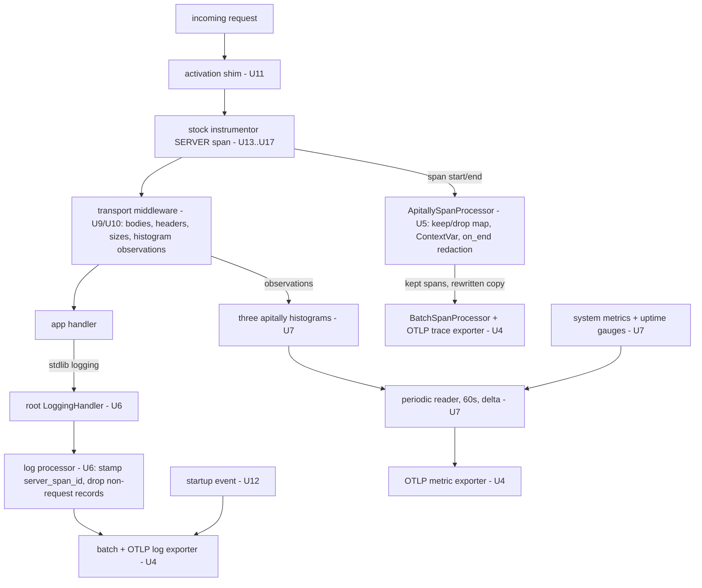
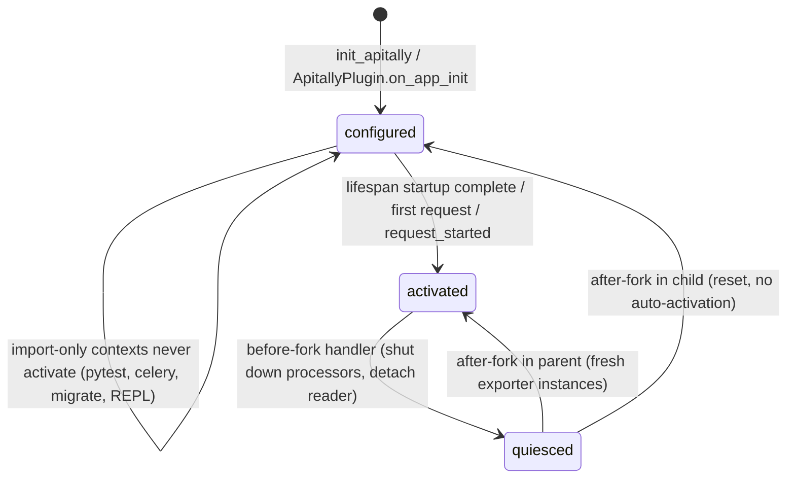

# Apitally Python SDK v1 - Plan

## Goal Capsule

- **Objective**: Implement the v1 rewrite of the Apitally Python SDK on the `v1` branch, turning it into an OpenTelemetry distribution per the settled design in `v1/design.md`, `v1/litestar.md`, and `v1/wsgi.md`, conforming to the wire contract in `v1/spec.md`.
- **Authority hierarchy**: `v1/spec.md` (normative wire contract, read-only) > `v1/design.md` + `v1/litestar.md` + `v1/wsgi.md` (settled design decisions) > this plan (sequencing, unit boundaries, test scenarios). The design docs went through two review rounds and five grilling sessions; they are input, not up for re-litigation during implementation.
- **Reuse posture**: Where v1 needs functionality 0.x provided in similar shape, port the proven 0.x implementation (available in git history after U1) and adapt it to the OTel pipeline. Improving on a 0.x approach is a conscious, recorded choice, never an accidental rewrite — no regressions on mechanics that already worked (KTD6).
- **Stop conditions**: Surface to the user instead of deciding alone when (a) implementation contradicts a design.md decision, (b) a wire-format question is not answered by spec.md, (c) a new always-installed dependency beyond design.md §11 seems needed, or (d) a verified library behavior (Litestar 2.24 internals, contrib 0.64b0 behavior) turns out different at implementation time.
- **Execution profile**: Work directly on the `v1` branch. Before starting U1, fetch and bring `v1` up to date with `origin/main` (merge). Each unit lands as an atomic commit with its tests; `make check` and `make test` pass at every unit boundary from U2 onward.

---

## Product Contract

### Summary

Rebuild the SDK as a thin OTel distribution: stock community instrumentors produce SERVER spans; Apitally adds transport-level capture, a filtering/redacting span processor, a request-scoped logs pipeline, an explicitly shaped metrics pipeline, and a serving-gated activation model. One-line setup (`init_apitally(app, write_token=...)`) is the #1 priority. The legacy Hub transport (`apitally/client/`, ~1.3k lines) is removed entirely.

### Problem Frame

The 0.x SDK carries a bespoke transport, per-framework duplication (request logging alone is 573 lines), and a `client_id`-based protocol the cloud is moving away from. The cloud's OTLP ingestion path (`otlp.apitally.io`) is live in production. v1 is the clean break that rides official OTel machinery and ships Apitally-specific behavior as thin layers.

### Requirements

Setup and public API

- R1. One entry point per framework: `init_apitally(app, ...)` for FastAPI, Starlette, Flask, BlackSheep; `init_apitally(...)` with no app at the end of `settings.py` for Django (incl. Ninja and DRF); `ApitallyPlugin(...)` passed at `Litestar()` construction (design.md §5, litestar.md).
- R2. Top-level surface: `set_consumer`, `set_request_attribute`, `capture_exception`, `instrument`, `span`, and the lazy `instrument_<x>` wrappers, all resolving the active SERVER span through the shared ContextVar (design.md §5).
- R3. `init_apitally(...)` is first-call-wins: an identical re-call is a silent no-op; a differing re-call warns once and is ignored (design.md §8).

OTel integration

- R4. Detect existing OTel at activation: own-it-all mode (own `TracerProvider`, explicit `ALWAYS_ON` sampler, pinned span limits) or cooperative mode (attach additively to the user's provider, warn once on recognizably lossy samplers, inspect span limits when capture is on). `MeterProvider` and `LoggerProvider` are always private instances (design.md §2).
- R5. A single span-filtering mechanism: `ApitallySpanProcessor` keeps request-rooted traces only, drops OPTIONS and excluded requests at span start, applies exclude callbacks, backstops receive/send noise spans, and forwards a redacted copy at span end (design.md §3, §6).
- R6. Metrics pipeline: the three `apitally`-scoped exponential histograms with delta temporality and `max_scale=3`, a 60 s export interval independent of traffic (liveness heartbeat), and the three process gauges (design.md §4, §12; spec §7).
- R7. Logs pipeline: root-logger `LoggingHandler` on by default (`capture_logs=False` opt-out), every exported record stamped with `apitally.request.server_span_id`, non-request records dropped except the startup event, SDK/OTel self-logs never bridged (design.md §10; spec §8).

Capture and privacy

- R8. Body and header capture off by default, implemented transport-level: one ASGI middleware, one WSGI middleware, per-framework adapters; MIME allowlist and 50,000-byte cap with `<body too large>` sentinel; mask callbacks fail closed to `<masked>` (design.md §6; wsgi.md; spec §6.3).
- R9. Redaction runs before any query, header, or body attribute is set or forwarded: spec §6.7 default patterns plus additive user patterns, shared across transport writes and the processor's on_end rewrite (design.md §6).
- R10. `http.request.body.size` / `http.response.body.size` set independently of capture toggles, feeding the size histograms so logs and metrics agree by construction (design.md §6).

Lifecycle and robustness

- R11. Serving-gated activation: configure eagerly in `init_apitally(...)`, activate on lifespan startup completion, first request, or Django `request_started`; imports alone never activate; test environments are detected and skipped (design.md §7).
- R12. Fork safety via `os.register_at_fork` handlers: quiesce before fork, reset in child without auto-activation, re-activate in parent with fresh exporter instances (design.md §7).
- R13. Errors never propagate to user code; quiet-by-default logging with WARNING reserved for actionable data loss; the raw write token never appears in logs (design.md §9).
- R14. Config precedence: explicit kwargs > `APITALLY_*` env vars > semantically equivalent `OTEL_*` env vars > defaults; the OTLP endpoint env vars are ignored in favor of `APITALLY_OTLP_ENDPOINT` (design.md §14).

Ecosystem integration

- R15. Framework coverage: FastAPI, Starlette, Django (incl. Ninja, DRF), Flask, Litestar, BlackSheep — each riding its stock instrumentor per design.md §4, handling pre-instrumented apps by detection and adaptation.
- R16. Sentry auto-detection writes `apitally.exception.sentry_event_id` to the SERVER span (design.md §15).
- R17. Dependency set per design.md §11: OTel API/SDK/HTTP-exporter >= 1.43.0, instrumentation packages >= 0.64b0; `backoff` and direct `psutil` dropped; per-framework extras pull framework + instrumentor.
- R18. Startup event per spec §9: one LogRecord under scope `apitally` with `event_name` `apitally.app.startup`, JSON body carrying framework, versions, paths, and OpenAPI spec.

Verification and release collateral

- R19. Test suite rewritten against OTel-side data (spans, metrics, logs via in-memory exporters and per-framework test clients), replacing legacy Hub payload assertions (design.md §18).
- R20. CI matrix rebuilt for the new dependency set across Python 3.10–3.14 and framework version floors.
- R21. README rewritten for v1 setup; migration guide as a 0.x → v1 lookup table, explicitly calling out the default-on logs change (design.md §10, §18).

### Scope Boundaries

**Deferred to Follow-Up Work**

- Other-language SDKs (design.md §17 posture only).
- GA release mechanics beyond alpha readiness; publishing itself stays a user action via git tags (existing `publish.yaml`).

Design-level exclusions (removed 0.x features, unhandled C-level forks, no log-content redaction in v1) are recorded in design.md §5, §7, §10 and are not re-listed here.

---

## Planning Contract

### Key Technical Decisions

Design decisions live in the design docs and are cited per unit rather than duplicated. The plan-local decisions:

- KTD1. **Teardown first.** U1 removes `apitally/client/`, the legacy framework module bodies, and the legacy test suite before any v1 code lands. The v1 branch is a clean break with alphas at the end; interleaving 0.x and v1 code would make every subsequent unit diff noisier. The deleted code remains in git history as the reference implementation for everything KTD6 ports. The package stays importable at every commit.
- KTD2. **Tests land with their unit.** Every feature-bearing unit ships its test file in the same commit. Shared-module units use OTel in-memory test doubles (`InMemorySpanExporter`, `InMemoryMetricReader`, `InMemoryLogExporter`); framework units add integration tests with that framework's test client, mirroring the 0.x per-framework test organization. Suites are right-sized, not maximized — the binding test philosophy lives in the Verification Contract.
- KTD3. **Module layout per design.md §16, treated as directive.** The one planned deviation: provider construction and mode detection get their own `apitally/shared/providers.py` (§16 marks the structure "rough"); `activation.py` stays the state machine and calls into it. Further splits are the implementer's call within `apitally/shared/`.
- KTD4. **Tooling carries over unchanged.** hatchling + hatch-vcs (alpha versions from git tags), uv, ruff, ty, pre-commit, and the Makefile targets stay as-is. Only dependency metadata and the CI matrix change.
- KTD5. **Docs are in scope.** README rewrite and the migration guide are the final unit — required before the first alpha invites outside users.
- KTD6. **Port from 0.x, don't reinvent.** Where a v1 behavior matches 0.x in shape — the WSGI Content-Length capture gate, masking/redaction mechanics, route and OpenAPI introspection for every framework, consumer semantics, the per-framework test apps — the 0.x implementation (git history after U1) is the starting point, adapted to the OTel pipeline. Deviating from a working 0.x approach is allowed only as a conscious choice recorded in the unit; this is the regression guard for mechanics that already worked.

### Code Style — binding for every unit

- Write the least amount of code that gets the job done.
- Write modern, well-structured, maintainable Python with good naming, following current best practices — within the supported range of Python 3.10–3.14. Use the modern syntax 3.10 allows (`X | Y` unions, `match`, parenthesized context managers); nothing that requires 3.11+ at runtime.
- Imports go at the top of the module. A function-body import needs a good reason (circular-import break, optional dependency, deferred heavy import) — and even then, imports are grouped at the top of the function body, never in the middle of other code.
- Underscore prefixes only where genuinely required to separate public from private API (user-facing modules). Internal modules do not prefix every variable and function.
- Function order within a module is deliberate, not accidental: public entry points first, helpers after, ordered so the module reads top-down.
- No single-use helper functions unless extraction meaningfully improves readability at the call site.
- Comments sparingly and concise (one or two lines). They explain the WHY, never narrate the WHAT — a comment that restates the code below it does not get written.

### Test posture

Assertions run against OTel-side data — in-memory exporters for shared modules, framework test clients driving real request flows for integrations. No mocking of Apitally internals; mock only at process boundaries (network, fork where impractical).

Test philosophy — binding for every unit:

- Mirror the 0.x suite's structure and level: one focused test module per shared module, one integration module per framework driving a small real app, shared fixtures in `tests/conftest.py`. The 0.x suite (~25 focused files) is the calibration point for size and style; port its test apps and fixtures where they fit (KTD6).
- Every test needs an important reason to exist: it pins a spec MUST, a design.md decision, or a behavior a plausible change would silently break. Tests that restate the implementation, or assert theoretical edge cases no real deployment hits, do not get written.
- The per-unit test scenarios in this plan are the intended set, not a floor — do not multiply them into variants.
- Prefer one integration test proving a flow end-to-end over several micro-tests asserting its intermediate steps.
- A shared autouse fixture in `tests/conftest.py` isolates process-global OTel state between tests: the config singleton, the tracer-provider global and its set-once flag (via `opentelemetry-test-utils` reset helpers, added to the test group in U1), the root-logger handler, singleton instrumentor state, and the semconv env var. Fork-handler registration is guarded by a module flag so repeated configure calls in one process register once.

### High-Level Technical Design

Runtime signal flow — the components each unit builds and how requests turn into exported telemetry:

Activation lifecycle (design.md §7):

### Sequencing

Five phases in strict order; units within a phase are parallelizable where their Dependencies allow: A. Foundation (U1–U3) → B. OTel core (U4–U8) → C. Transport and lifecycle (U9–U12) → D. Framework integrations (U13–U18) → E. CI and docs (U19–U20).

---

## Implementation Units

| U-ID | Unit | Key files | Depends on |
|---|---|---|---|
| U1 | Teardown and packaging reset | `pyproject.toml`, `apitally/`, `tests/` | — |
| U2 | Configuration module | `apitally/shared/config.py` | U1 |
| U3 | Redaction module | `apitally/shared/redaction.py` | U1 |
| U4 | Providers and mode detection | `apitally/shared/providers.py` | U2 |
| U5 | Span processor | `apitally/shared/span_processor.py` | U3, U4 |
| U6 | Logs pipeline | `apitally/shared/log_processor.py` | U4, U5 |
| U7 | Metrics pipeline | `apitally/shared/metrics.py` | U4 |
| U8 | Public API surface | `apitally/__init__.py`, `apitally/shared/consumer.py` | U5 |
| U9 | ASGI transport middleware | `apitally/shared/asgi.py` | U3, U7, U8 |
| U10 | WSGI transport middleware | `apitally/shared/wsgi.py` | U3, U7, U8 |
| U11 | Activation state machine and fork safety | `apitally/shared/activation.py` | U4, U6, U7 |
| U12 | Startup event | `apitally/shared/startup.py` | U6, U11 |
| U13 | Starlette and FastAPI integrations | `apitally/starlette.py`, `apitally/fastapi.py` | U9, U11, U12 |
| U14 | Flask integration | `apitally/flask.py` | U10, U11, U12 |
| U15 | Django integrations | `apitally/django.py`, `apitally/django_ninja.py`, `apitally/django_rest_framework.py` | U9, U10, U11, U12 |
| U16 | Litestar plugin | `apitally/litestar.py` | U5, U9, U11, U12 |
| U17 | BlackSheep integration | `apitally/blacksheep.py` | U9, U11, U12 |
| U18 | Sentry integration | `apitally/shared/sentry.py` | U5, U8, U11 |
| U19 | CI matrix and tooling update | `.github/workflows/tests.yaml` | U13–U17 |
| U20 | README and migration guide | `README.md`, `docs/` | U13–U18 |

### U1. Teardown and packaging reset

- **Goal**: Clean-break skeleton — legacy code gone, v1 dependency set in place, package importable.
- **Requirements**: R17.
- **Files**: Delete `apitally/client/` and the bodies of `apitally/{fastapi,starlette,flask,django,django_ninja,django_rest_framework,litestar,blacksheep}.py` plus `apitally/common.py`; delete `tests/` contents except `tests/__init__.py`; rewrite `pyproject.toml`; create `apitally/shared/__init__.py`; keep `apitally/otel.py` and `apitally/py.typed`.
- **Approach**: Required deps per design.md §11 (`opentelemetry-api`, `-sdk`, `-exporter-otlp-proto-http` >= 1.43.0; `-instrumentation`, `-instrumentation-logging`, `-instrumentation-system-metrics` >= 0.64b0). Drop `backoff` and direct `psutil`. Per-framework extras become framework + its stock instrumentor — the only published extras; the `django_rest_framework` extra additionally keeps `uritemplate` and `inflection` (DRF schema generation needs them — 0.x parity, KTD6). The `sentry` and `otel` dependency groups stay dev-side as in 0.x (test deps for the Sentry integration and the `instrument_<x>` wrappers), not published extras: a Sentry user already has `sentry-sdk` installed, and contrib instrumentation packages are installed individually by the users who want them. The dev/test groups provision all frameworks and instrumentors (plus `opentelemetry-test-utils`) so `make test` runs integration tests from U13 onward. Framework version floors stay where they are; verify each against the pinned instrumentor's `_instruments` metadata and adjust only where the instrumentor demands it (design.md §11). Keep one placeholder smoke test (`tests/test_import.py`, asserting `import apitally` succeeds) so pytest doesn't exit 5 on an empty suite — removed when U2's real tests land; trim `tests.yaml` to the coverage job; the matrix is rebuilt in U19. Framework module files may remain as empty stubs so extras metadata and imports resolve.
- **Test scenarios**: The `tests/test_import.py` smoke test only. Verification is `uv lock` resolving, `make check` passing, and `python -c "import apitally"` succeeding in a fresh venv.
- **Verification**: Fresh `uv sync` + `make check` green; no references to `apitally.client` remain anywhere in the repo.

### U2. Configuration module

- **Goal**: One place that owns kwargs, env vars, precedence, and the first-call-wins singleton.
- **Requirements**: R3, R14; parts of R13 (token masking).
- **Files**: `apitally/shared/config.py`, `tests/test_config.py`.
- **Approach**: Typed config object holding the design.md §5 cross-framework kwargs. Loading precedence per §14; `APITALLY_*` mappings per the §14 table; respected and ignored `OTEL_*` vars per §14. Module-level singleton (§8): the first call applies; an identical re-call no-ops, a differing re-call warns once and is ignored — config is immutable after configure, so components bind it and their derived state at construction. Write-token format check (`apt_` + 24 alphanumeric, spec §3) with the masked-form helper (`apt_3kPm…`) for any log message referencing the token (§9). Include the configure-time semconv helper: set `OTEL_SEMCONV_STABILITY_OPT_IN=http/dup` only when unset (§4).
- **Test scenarios**: Kwarg beats `APITALLY_ENV`; `APITALLY_WRITE_TOKEN` read when kwarg absent; `APITALLY_DISABLED=1` yields disabled config; invalid token format logs an error containing only the masked form and never the full token; re-call with identical kwargs is a silent no-op and a re-call with a changed `env` warns once and keeps the first config; semconv helper sets `http/dup` when the env var is unset and leaves an existing value untouched.
- **Verification**: The §14 precedence ordering is proven by one representative test per level, not an exhaustive combination matrix.

### U3. Redaction module

- **Goal**: Shared pattern table and apply functions for query params, headers, and body fields.
- **Requirements**: R9.
- **Files**: `apitally/shared/redaction.py`, `tests/test_redaction.py`.
- **Approach**: The three default pattern sets from spec §6.7 (query / header / body-field), case-insensitive substring match on names, replacement value `[REDACTED]`. User patterns extend defaults, never replace. Exposed operations: redact a query string (param names in `url.query`, `http.target`, `http.url` forms), redact a header mapping (used both by transport capture and the processor's on_end pass), and walk a parsed JSON body replacing string values under matching keys, recursing into nested objects (spec §6.7). The matching and body-walk mechanics port from 0.x `apitally/client/request_logging.py` via git history (KTD6); the pattern tables come from spec §6.7.
- **Test scenarios**: One test per target table (query, header, body field) using a few representative names to prove substring and case-insensitive matching, including one regex-bearing pattern each (`api-?key`, `card[-_ ]?number`); the JSON walk replaces string values under matching keys at any nesting depth and leaves non-string values untouched; user patterns extend the defaults; a mixed query string redacts only matching params and preserves the rest.
- **Verification**: The default pattern tables match spec §6.7 by inspection; tests prove matching behavior, not table contents.

### U4. Providers and mode detection

- **Goal**: Everything that constructs or attaches providers and exporters, resolved at activation time.
- **Requirements**: R4; parts of R14 (endpoint override, resource env vars).
- **Files**: `apitally/shared/providers.py`, `tests/test_providers.py`.
- **Approach**: Mode detection via `trace.get_tracer_provider()` — `ProxyTracerProvider` means own-it-all (design.md §2). Own-it-all: `TracerProvider` with explicit `ALWAYS_ON` sampler, `SpanLimits(max_attribute_length=65_536, max_span_attribute_length=65_536)` (both fields pinned, §2), Resource carrying `service.instance.id` (UUID4 per process), `deployment.environment.name`, `telemetry.distro.name=apitally-py`, `telemetry.distro.version`, merged with `OTEL_SERVICE_NAME` / `OTEL_RESOURCE_ATTRIBUTES` (§14; spec §5); register globally. Cooperative: attach our processor to the user's provider; warn once when the sampler is recognizably lossy (`ALWAYS_OFF`, `TraceIdRatioBased`, `ParentBased` with non-`ALWAYS_ON` root), DEBUG otherwise; inspect `_span_limits.max_span_attribute_length` when body/header capture is on and warn below 65,536 (§2). Private `MeterProvider`/`LoggerProvider` always, never registered globally (§2). Env resolution per §2 (own-it-all: kwarg/env/default; cooperative: user Resource wins, conflict warns) feeding both the Resource and the `Apitally-Env` exporter header (spec §4). OTLP HTTP exporters for all three signals with `Authorization: Bearer` header, default endpoint `https://otlp.apitally.io`, `APITALLY_OTLP_ENDPOINT` override, `OTEL_EXPORTER_OTLP_*` ignored (§14).
- **Test scenarios**: Proxy provider detected as own-it-all, real SDK provider as cooperative; own-it-all sampler is `ALWAYS_ON` even with `OTEL_TRACES_SAMPLER=always_off` in the environment; span limits are 65,536 even with `OTEL_ATTRIBUTE_VALUE_LENGTH_LIMIT=100` set; cooperative with `TraceIdRatioBased(0.1)` warns once naming the remedy, a second activation check does not re-warn; a custom sampler object produces DEBUG only; cooperative env conflict (`env=` kwarg vs user Resource value) warns and uses the Resource value; `Apitally-Env` header equals `deployment.environment.name` in both modes; exporter endpoint honors `APITALLY_OTLP_ENDPOINT` and ignores `OTEL_EXPORTER_OTLP_ENDPOINT`; cooperative span-limit inspection warns when the user provider has a 4,096 limit and capture is enabled, stays silent when capture is off.
- **Verification**: Both modes construct working pipelines against in-memory exporters; resource attributes assert against spec §5.

### U5. Span processor

- **Goal**: `ApitallySpanProcessor` — the single keep/drop mechanism, the SERVER-span ContextVar, and the on_end redaction rewrite.
- **Requirements**: R5, R9; parts of R2 (ContextVar consumed by the public API).
- **Files**: `apitally/shared/span_processor.py`, `tests/test_span_processor.py`.
- **Approach**: Implement design.md §3 exactly: in-flight map `span_id → (keep, server_span_id)`; local-root classification (`span.parent is None or span.parent.is_remote`); SERVER local roots enter kept unless OPTIONS, excluded path/user-agent (spec §6.8 defaults + user path patterns, old-semconv attribute fallbacks), or `exclude_on_request` returns True; children inherit; lookup miss defaults to drop. The receive/send/websocket INTERNAL backstop keyed on span-name suffix + instrumentation scope prefix (§3). ContextVar set on every local-root SERVER span at `on_start` regardless of keep (§5). At `on_end`: pop the map, evaluate `exclude_on_response` for kept SERVER spans, then forward a rewritten `ReadableSpan` copy with §6.7 query redaction applied to `url.query`/`http.target`/`http.url` and header redaction applied to `http.request.header.*`/`http.response.header.*` in both dash and underscore normalizations; the original span object is never mutated (§6). Callback errors warn and count as not excluded (§9). The wrapped `BatchSpanProcessor` + exporter are swappable for fork re-activation (§7).
- **Test scenarios**: SERVER local root kept, its INTERNAL child kept via inheritance; SERVER with remote parent kept; a non-SERVER local root and its children dropped; OPTIONS SERVER span dropped; a default excluded path (`/healthz`) and user agent (`kube-probe`) dropped, including via the old-semconv fallback attributes; a user path pattern adds to the defaults; `exclude_on_request` returning True drops with nothing forwarded, a raising callback warns and keeps; `exclude_on_response` on the response status drops at end; a `... http send` INTERNAL span under a kept SERVER dropped when its scope is a contrib instrumentor's, kept when user-owned; the forwarded copy carries `token=[REDACTED]` in `url.query` and redacted header attributes in both key normalizations while the original span is unmutated; the ContextVar resolves the SERVER span from inside a child span and is empty outside a request.
- **Verification**: All spec §6.5, §6.6, §6.8 MUSTs covered by an explicit test each.

### U6. Logs pipeline

- **Goal**: Root-logger bridge plus the log processor that stamps and filters records.
- **Requirements**: R7.
- **Files**: `apitally/shared/log_processor.py`, `tests/test_logs.py`.
- **Approach**: Install `LoggingHandler` (from `opentelemetry-instrumentation-logging`) directly via `addHandler` with our private `LoggerProvider`, level `NOTSET` (design.md §10); never through `LoggingInstrumentor`. A filter keeps `apitally.*` and `opentelemetry.*` logger records out of the bridge. Our `LogRecordProcessor.on_emit` resolves `record.span_id` through the U5 shared map and writes `apitally.request.server_span_id` as lowercase hex (spec §8); records without a resolution are dropped unless instrumentation scope is `apitally` (preserves the startup event). `capture_logs=False` skips handler installation. Batch export path swappable for fork re-activation.
- **Test scenarios**: A log emitted inside a nested INTERNAL child span carries the SERVER span's id, not the child's; a log emitted with no active request is dropped; a record under scope `apitally` without request context passes; records from `apitally.*` and `opentelemetry.*` loggers reach user-attached handlers but never the OTLP export; `capture_logs=False` installs no root handler; an excluded request contributes no log records (shared-map semantics from U5).
- **Verification**: Exported records assert non-empty `trace_id` + `apitally.request.server_span_id` per spec §8.

### U7. Metrics pipeline

- **Goal**: The explicitly shaped metrics pipeline: three request histograms, process gauges, uptime, 60 s heartbeat.
- **Requirements**: R6.
- **Files**: `apitally/shared/metrics.py`, `tests/test_metrics.py`.
- **Approach**: `PeriodicExportingMetricReader(exporter, export_interval_millis=60_000)` — interval passed explicitly so `OTEL_METRIC_EXPORT_INTERVAL` never applies (design.md §4); exporter configured with `preferred_temporality={Histogram: DELTA}` and `preferred_aggregation={Histogram: ExponentialBucketHistogramAggregation(max_scale=3)}` keyed on the SDK instrument class (§4). Meter scope name `apitally` (spec §7.1) creating `http.server.request.duration` (s), `http.server.request.body.size` (By), `http.server.response.body.size` (By). A record-request helper takes method, route, status code, consumer identifier, duration, and optional sizes; sets the four aggregation-key attributes (consumer omitted when absent) plus `url.scheme` and `error.type` where known; skips OPTIONS and unmatched-route requests entirely (spec §7.1); excluded requests are still recorded (spec §6.8). `SystemMetricsInstrumentor` with `config={"process.cpu.utilization": None, "process.memory.usage": None}` and our `meter_provider` (design.md §12); hand-rolled `process.uptime` observable gauge from `time.monotonic()` delta. Reader detach/attach supported for fork quiesce/re-activation (§7). The metrics pipeline is fully independent of the trace pipeline — transport middleware → private `MeterProvider` → reader → exporter, mirroring 0.x's middleware → `RequestCounter` flow (KTD6); no span is ever consulted, so sampling can never affect metrics completeness.
- **Test scenarios**: Collected duration histogram data point is exponential with delta temporality and scale <= 3; setting `OTEL_METRIC_EXPORT_INTERVAL=5000` leaves the reader on 60,000 ms; helper called with consumer records `apitally.consumer.identifier`, without consumer omits the attribute entirely; OPTIONS and empty-route calls record nothing; an excluded request records normally; size observation absent when size unknown while duration still records; system metrics collection yields exactly `process.cpu.utilization`, `process.memory.usage`, `process.uptime` and nothing else; cpu/mem data points share one timestamp with empty attributes; process gauges keep last-value aggregation (not exponential histogram) despite the histogram-keyed overrides.
- **Verification**: A full collect cycle through `InMemoryMetricReader` matches the spec §7.1/§7.2 shapes.

### U8. Public API surface

- **Goal**: The user-facing functions, all resolving the SERVER span through the U5 ContextVar.
- **Requirements**: R2.
- **Files**: `apitally/__init__.py`, `apitally/shared/consumer.py`, `apitally/otel.py` (review/keep), `tests/test_public_api.py`.
- **Approach**: `set_consumer(identifier, name=None, group=None)` writes the spec §6.2 attributes to the SERVER span and always records the identifier in the transport middleware's request-scoped holder (U9/U10), so consumer-dimension metrics stay complete even when a cooperative sampler drops the span (0.x parity); `set_request_attribute(key, value)` writes arbitrary attributes; `capture_exception(exc)` records a standard OTel `exception` event on the SERVER span (spec §6.4). All three no-op silently when the ContextVar is empty (no active request, or cooperative-sampler-dropped request — design.md §5 caveats). `instrument`, `span`, and `instrument_<x>` lazy wrappers carry over from the existing `apitally/otel.py` with imports adjusted; before activation they ride OTel's proxy tracer and no-op silently, upgrading automatically once the provider registers — no guard code. `apitally/__init__.py` exports exactly the design.md §16 list.
- **Test scenarios**: `set_consumer` called inside a child span writes all three attributes to the SERVER span, not the child; `set_request_attribute` outside any request is a silent no-op; `capture_exception(ValueError("x"))` produces a standard `exception` event on the SERVER span; `instrument`-decorated function creates a child span under the SERVER span; writes to a request whose span was classified as dropped stay local (nothing exported).
- **Verification**: Public surface matches design.md §5's table one-to-one; no removed 0.x symbols (`ApitallyMiddleware`, `consumer_callback`, `client_id`) exist anywhere.

### U9. ASGI transport middleware

- **Goal**: The single ASGI middleware doing body/header capture, size attributes, and histogram observations.
- **Requirements**: R8, R9, R10.
- **Files**: `apitally/shared/asgi.py`, `tests/test_asgi_transport.py`.
- **Approach**: Runs inside the instrumentor's middleware (ordering per design.md §6, wired per framework in U13–U17). Capture decisions are header-only before any body I/O: MIME allowlist from request headers / `http.response.start` headers (spec §6.3 list, prefix match ignoring charset). Request bodies: accumulate `http.request` messages with a running length check, always forwarding; crossing 50,000 bytes discards the buffer and sets `<body too large>`. Response bodies: accumulate sent chunks under the same rule. Mask callbacks then JSON-parse → redact (U3) → re-serialize → set `apitally.request.body`/`apitally.response.body` on the ContextVar span; callback `None` or raise → `<masked>` (fail closed, §6). Header capture when toggled on: request headers from scope at entry, response headers from `http.response.start` in the send wrapper; capture-all-then-redact via U3; dash-form lowercase list-valued keys, repeated headers as separate elements (§6). Size attributes independent of toggles: request from Content-Length with capture backfill; response from Content-Length or a running counter written before the final send message (§6). The middleware sets a request-scoped info holder (its own ContextVar) at request entry; `set_consumer` writes the consumer identifier there in addition to the span (U8), so the consumer dimension survives sampled-out spans. At request completion, call the U7 record-request helper with transport-sourced attributes — method from the scope, status from the `http.response.start` message, route from `scope["route"]` (FastAPI) or the ported 0.x route resolver (Starlette; other frameworks supply their own source), consumer from the holder — and middleware-measured duration. Nothing is read from the span for metrics, keeping the histograms complete under lossy cooperative samplers (design.md §2; 0.x parity). Accumulation, sentinel, and masking-order mechanics follow the 0.x middleware implementations (KTD6).
- **Test scenarios**: JSON request body captured and redacted (`{"password": "x"}` → `[REDACTED]`) when the toggle is on; toggle off means no body attribute and zero buffering (pass-through asserted); non-allowlisted MIME (`image/png`) never touches the body while `text/plain; charset=utf-8` still matches; a body crossing 50,000 bytes yields `<body too large>` with the downstream app still receiving every chunk; a mask callback returning `None` or raising yields `<masked>` (warning on raise); captured headers are redacted before set and repeated response headers become list values; request size backfills from accumulated length when Content-Length is absent, response size comes from the running counter on chunked responses while the span is recording; the histogram helper fires once per request with route/status/consumer (consumer set mid-request included); under a cooperative provider with `TraceIdRatioBased(0.0)` the duration histogram still records, consumer attribute intact.
- **Verification**: Raw-ASGI harness tests (no framework) prove transport independence; body pass-through byte-identical in all capture states.

### U10. WSGI transport middleware

- **Goal**: The WSGI counterpart per wsgi.md.
- **Requirements**: R8, R9, R10.
- **Files**: `apitally/shared/wsgi.py`, `tests/test_wsgi_transport.py`.
- **Approach**: MIME allowlist first from `CONTENT_TYPE` alone; then capture only when `CONTENT_LENGTH` parses to an int: over cap → sentinel without reading a byte; otherwise `read(content_length)` and re-emit as `BytesIO` (wsgi.md — the gate is a correctness requirement against raw-socket dev servers). Chunked/absent-length request bodies not captured. Response bodies accumulated from the response iterable under the running-length rule. Wrapped `start_response` captures request headers (from closure-captured environ) and wire-final response headers, and the response Content-Length for the size attribute (absent/streaming → unset). Same mask → redact → set pipeline and histogram recording as U9, with transport-sourced attributes (method/status from environ and `start_response`, route from the framework adapter, consumer from the request-scoped holder). WSGI environ header repeats arrive comma-joined as one list element (design.md §6).
- **Test scenarios**: `CONTENT_LENGTH=70000` with allowlisted MIME yields `<body too large>` without a single read (spy input asserts zero reads); absent or unparseable `CONTENT_LENGTH` means no capture and `wsgi.input` untouched; a captured body is re-emitted so the app reads identical bytes; non-allowlisted MIME never replaces `wsgi.input`; the response iterable is accumulated, redacted, and its `close()` propagated; `HTTP_AUTHORIZATION` redacted in captured request headers; a streaming response without Content-Length leaves the size attribute unset.
- **Verification**: PEP 3333 conformance — the middleware never reads past Content-Length under any configuration.

### U11. Activation state machine and fork safety

- **Goal**: The configure/activate lifecycle, the shim, test-environment detection, and the fork handlers.
- **Requirements**: R11, R12; parts of R13.
- **Files**: `apitally/shared/activation.py`, `tests/test_activation.py`, `tests/test_fork.py`.
- **Approach**: Configure phase per design.md §7: record config (U2), set the semconv var, attach transport middleware and instrumentor (framework adapters own the mechanics), install the shim, build meter/histograms on the private provider — no threads, no network. Activate phase: mode detection and provider registration (U4), deferred inspections, exporter + heartbeat start, then an on-activate hook list runs last (empty at U11, exercised by a test double; U12 registers the startup-event emitter there). Triggers: ASGI shim observes `lifespan.startup.complete` on its send path or the first request; WSGI shim on first request; Django on `request_started`. The shim is a flag check + one-time activate + delegate. Test-environment detection at the activation boundary: `PYTEST_CURRENT_TEST`, `sys.argv[1:2] == ["test"]`, `APITALLY_DISABLED`, `disabled=True` (§7). Fork handlers registered once at configure via `os.register_at_fork`: before — when activated, shut down batch processors and detach the metric reader (reader subclass no-ops `collect()` while quiescing); after-in-child — reset to configured, no auto-activation; after-in-parent — re-activate with fresh `BatchSpanProcessor`/exporter swapped inside the U5/U6 wrappers and a fresh reader attached via `add_metric_reader`; keep strong references to swapped-out instances (§7).
- **Execution note**: Clear `PYTEST_CURRENT_TEST` via monkeypatch in every test that exercises activation, or activation will self-suppress under the test runner.
- **Test scenarios**: Configure starts no threads; a simulated `lifespan.startup.complete` through the shim activates exactly once, and `startup.failed` defers to the first-request trigger; the first-request path activates before the request proceeds; each test-environment guard (`PYTEST_CURRENT_TEST`, `manage.py test` argv, `APITALLY_DISABLED`, `disabled=True`) skips activation — one parametrized test; after a simulated before-fork, no SDK-owned threads remain alive; after-fork-in-parent re-activation exports spans through the swapped processor (in-memory assertion); a forked child (`multiprocessing` fork start method, Linux CI) stays inert until it crosses an activation gate, then mints its own `service.instance.id`; `os.fork` in an activated process does not deadlock.
- **Verification**: State machine transitions match the HTD state diagram exactly; fork tests pass on Linux CI (skip-marked on macOS where the fork start method differs).

### U12. Startup event

- **Goal**: The spec §9 startup event, emitted once at activation.
- **Requirements**: R18.
- **Files**: `apitally/shared/startup.py`, `apitally/shared/activation.py` (hook registration), `tests/test_startup_event.py`.
- **Approach**: Framework adapters supply `framework`, `paths` (method + route template, optional summary/description), `versions` (python, framework, optional `app` from the `app_version` kwarg), and an OpenAPI JSON string where the framework provides one. Emit directly on the private `LoggerProvider` (bypasses the U6 bridge) under instrumentation scope `apitally` with `event_name` `apitally.app.startup` and the JSON payload as string body; omit `openapi` above 4,000,000 bytes (spec §9). Registered on U11's on-activate hook list; runs as the last activation step.
- **Test scenarios**: Emitted record has scope `apitally`, the event name in the native `event_name` field, `time_unix_nano` set, no `trace_id`, and a JSON body carrying `framework`, `versions` (incl. the Python runtime), and `paths`; an OpenAPI string above the 4 MB threshold is omitted while `paths` remain; emitted exactly once across activate → ignored re-call → re-activate-after-fork in the parent.
- **Verification**: Payload validates against the spec §9 field contract.

### U13. Starlette and FastAPI integrations

- **Goal**: `init_apitally` for Starlette and FastAPI with correct ordering, shim attachment, and pre-instrumented adaptation.
- **Requirements**: R1, R15; integrates U9, U11, U12.
- **Files**: `apitally/starlette.py`, `apitally/fastapi.py`, `tests/test_starlette.py`, `tests/test_fastapi.py`.
- **Approach**: Starlette: attach transport middleware, then `StarletteInstrumentor.instrument_app` (no `exclude_spans` support — U5 backstop covers receive/send), then `add_middleware(shim)` so the shim is outermost (design.md §6, §7). FastAPI: `FastAPIInstrumentor.instrument_app` with `exclude_spans=["receive", "send"]`; transport middleware via `add_middleware` (lands inside — instrumentor wraps the whole built stack); shim via chain-patching `app.build_middleware_stack` after our instrument call (§7). Pre-instrumented detection via the per-app `_is_instrumented_by_opentelemetry` attribute: skip our instrument call; on Starlette additionally insert the transport middleware into `app.user_middleware` immediately after the existing `OpenTelemetryMiddleware` entry (§4). Route + OpenAPI collection for U12 (FastAPI `app.openapi()` honoring `openapi_url`/`app_version` kwargs; Starlette route list). Framework-specific kwargs per design.md §5.
- **Test scenarios**: A request through the FastAPI TestClient exports one SERVER span with stable-semconv method, parameterized route, and status, and no receive/send spans; the duration histogram records with matching attributes and a handler log carries `apitally.request.server_span_id`; lifespan startup activates before the first request (startup event first); `/healthz` is excluded from spans but counted in histograms, OPTIONS appears in neither; body capture end-to-end when enabled (POST JSON exports a redacted `apitally.request.body`); a pre-instrumented app adapts without duplicate SERVER spans and the transport middleware still captures; an unhandled exception produces an `exception` event and a recorded 500; the startup event's `paths` match the app's routes and its OpenAPI string parses; the same core flows once for plain Starlette.
- **Verification**: Integration flows assert exclusively on OTel-side data via in-memory exporters (R19); both old-version floor and latest framework pass locally.

### U14. Flask integration

- **Goal**: `init_apitally` for Flask with hook-timed span writes per design.md §6.
- **Requirements**: R1, R15; integrates U10, U11, U12.
- **Files**: `apitally/flask.py`, `tests/test_flask.py`.
- **Approach**: Attach the WSGI transport middleware (buffering/accounting role only on Flask), then `FlaskInstrumentor`, then wrap `wsgi_app` with the shim outermost (§6, §7). Span writes at Flask-side points: request body and response headers at the wrapped `start_response`; response body in an `after_request` hook via `response.get_data()` when `direct_passthrough` is false; streaming responses not captured (documented limitation, §6). Pre-instrumented detection via the instrumentor guard. Route collection from `app.url_map` for U12. Activation on first request through the shim. Adapter mechanics port from 0.x `apitally/flask.py` where shapes match (KTD6).
- **Test scenarios**: A request through the Flask test client exports a SERVER span with route template and status; captured request and response bodies land while the span is recording (present on the exported span — the ordering proof); a streaming (`direct_passthrough`) response gets no body attribute and no size, and is still recorded; response headers captured wire-final; the first request activates and is itself recorded; a consumer set inside a route function reaches span and histogram; a pre-instrumented Flask app adapts without double spans.
- **Verification**: Same OTel-side assertion style as U13; capture works under `flask run`-style dev server semantics (unit-level: the U10 Content-Length gate is what protects this).

### U15. Django integrations

- **Goal**: `init_apitally()` from `settings.py` covering plain Django, Django Ninja, and DRF.
- **Requirements**: R1, R15; integrates U9/U10 semantics, U11, U12.
- **Files**: `apitally/django.py`, `apitally/django_ninja.py`, `apitally/django_rest_framework.py`, `tests/test_django.py`, `tests/test_django_ninja.py`, `tests/test_django_rest_framework.py`.
- **Approach**: `init_apitally(...)` with no `app` argument, called at the end of `settings.py` after `MIDDLEWARE` is defined (design.md §5). `DjangoInstrumentor` installs its middleware at `MIDDLEWARE[0]`; the Apitally glue middleware entry goes after it (§6), running inside the SERVER span. Insertion is automatic — `init_apitally` mutates the `MIDDLEWARE` list of the settings module it is called from, preserving the one-line promise (no manual `MIDDLEWARE` entry, unlike 0.x); the exact location mechanics are an implementation detail pinned by this unit's integration tests. On Django the glue middleware is the transport adapter: request body via `request.body` (Django buffers safely), response body from `response.content` for non-streaming responses, header capture and size attributes per §6 (Content-Length or `len(response.content)`; streaming → unset), all through the same U3 redaction and U7 histogram paths. Activation on the first `django.core.signals.request_started`, connected at configure (§7) — no shim needed. `manage.py test` guard via `sys.argv` (U11). Route collection for U12 ports the 0.x URL-resolver introspection; `django_ninja.py` and `django_rest_framework.py` are thin re-export/glue modules (design.md §16) whose schema/OpenAPI extraction is ported from the 0.x implementations via git history (KTD6), adapted only where the startup-event payload requires. There is one `init_apitally`, in `apitally/django.py`.
- **Test scenarios**: A request through the Django test client exports a SERVER span with parameterized `http.route` and status; `request_started` activates before the first span (startup event ordering); a management-command context (`migrate` argv) configures but never activates; DRF viewset route templates collected into the startup event paths and Ninja OpenAPI JSON included in the payload; body capture on a JSON POST redacts configured fields; `StreamingHttpResponse` gets no body attribute and no size, and is still recorded; a consumer set in a view reaches span and histogram; an exception in a view produces an `exception` event and a recorded 500.
- **Verification**: The 0.x module-reset pattern for Django settings isolation carries over in tests; all three Django flavors pass against their floor and latest versions locally.

### U16. Litestar plugin

- **Goal**: `ApitallyPlugin` per litestar.md — detection, config install, route repair.
- **Requirements**: R1, R15; integrates U9, U11, U12.
- **Files**: `apitally/litestar.py`, `tests/test_litestar.py`.
- **Approach**: `ApitallyPlugin(...)` takes the `init_apitally` kwargs and runs configure from `on_app_init` through the U2 singleton (litestar.md). Detection: a stock `OpenTelemetryPlugin` in `app_config.plugins` OR an OTel `DefineMiddleware` in `app_config.middleware` → skip installing our config. Otherwise append a stock `OpenTelemetryPlugin(OpenTelemetryConfig(exclude_spans=["receive", "send"]))` to `app_config.plugins` via reassignment — never via the middleware list (litestar.md: the hoist path is last-one-wins). Append the transport middleware to `app_config.middleware` in both cases (route level = inside the SERVER span, no ordering work). Register the `before_send` hook that writes `http.route` from `scope["path_template"]` and renames the span via the ContextVar (litestar.md). Activation via an `on_startup` hook appended to `app_config.on_startup` in `on_app_init` — it runs during lifespan startup, before the server serves. There is no shim and no first-request fallback: lifespan-disabled deployments are unsupported SDK-wide (design.md §7). Route collection + OpenAPI from Litestar's app for U12.
- **Test scenarios**: Request through Litestar test client exports a SERVER span whose `http.route` is the bare parameterized template (`/users/{user_id:int}` normalized per Litestar) and whose span name is `GET /users/{user_id:int}` — not the raw path; no receive/send spans exported; user app constructed with its own `OpenTelemetryPlugin` → our config not installed, spans still export with repaired routes, no duplicate SERVER spans; legacy pattern (raw OTel `DefineMiddleware` in the middleware list) also detected and skipped; excluded request → route write is local-only, nothing exported; transport middleware captures bodies inside the SERVER span when enabled; `on_startup` activation precedes the first request; plugin re-construction with same kwargs is a silent no-op per U2.
- **Verification**: All litestar.md mechanics tests pass against Litestar 2.24 (the verified floor) and latest.

### U17. BlackSheep integration

- **Goal**: `init_apitally` for BlackSheep via the `_handle_http` wrap and router-based route resolution.
- **Requirements**: R1, R15; integrates U9, U11, U12.
- **Files**: `apitally/blacksheep.py`, `tests/test_blacksheep.py`.
- **Approach**: Wrap `app._handle_http` with shim → generic ASGI `OpenTelemetryMiddleware` (`exclude_spans=["receive", "send"]`) → transport middleware (design.md §4 — per-instance `__call__` assignment is ignored by Python's type-based lookup, so `_handle_http` is the interposition point). Route resolution by wrapping `app.router.get_match`: on match, set `http.route` and update the span name via the ContextVar; the `"*"` pattern (BlackSheep >= 2.4.4) is treated as no route. Activation hooks the public `app.on_start` event; the lifespan-skip path relies on `_handle_http` awaiting `start()` before dispatch (§4). Websockets untouched. Route collection from the router for U12.
- **Test scenarios**: Request through the BlackSheep test client exports a SERVER span with the matched route template and updated span name; unmatched request (404) exports a span with no `http.route` and is skipped by the histogram helper; server-without-lifespan scenario: first request activates and records (the structural `_handle_http` guarantee); pre-instrumented app (existing `OpenTelemetryMiddleware` in the chain) detected and adapted; body capture E2E when enabled; the `_handle_http` integration test pins the private-API dependency — it fails loudly if BlackSheep renames or re-signatures it.
- **Verification**: Integration test explicitly marked as the §4 private-API canary.

### U18. Sentry integration

- **Goal**: Auto-detected Sentry event-id linkage.
- **Requirements**: R16.
- **Files**: `apitally/shared/sentry.py`, `apitally/shared/activation.py` (configure-phase wiring), `tests/test_sentry.py`.
- **Approach**: At configure (wired into U11's configure phase), detect an importable `sentry_sdk`; when present, install a hook that reads Sentry's last event id on exception capture and writes `apitally.exception.sentry_event_id` to the ContextVar SERVER span (design.md §15). No opt-in flag, no published extra — a Sentry user already has `sentry-sdk` installed; the dev-side dependency group covers testing.
- **Test scenarios**: With `sentry_sdk` initialized and an unhandled exception in a request, the exported SERVER span carries `apitally.exception.sentry_event_id` matching Sentry's captured event id; without `sentry_sdk` installed (simulated via import blocking), configure completes silently and no hook exists; a Sentry hook error is swallowed per R13 (request unaffected).
- **Verification**: Runs in the coverage job where `sentry-sdk` is installed via the test group.

### U19. CI matrix and tooling update

- **Goal**: Rebuild the test matrix for the v1 dependency set.
- **Requirements**: R20.
- **Files**: `.github/workflows/tests.yaml`, `Makefile` (verify only), `pyproject.toml` (dev/test groups as needed).
- **Approach**: Restore the two-job shape: coverage job on latest Python with all extras and groups (ruff, ty, pytest + Codecov), matrix job across Python 3.10–3.14 × framework/version combinations. Matrix combinations now install the framework + its pinned instrumentor; include each framework's floor and latest, with exclusions mirroring the 0.x pattern (old framework versions skipped on new Pythons). Finalize framework floors against each instrumentor's `_instruments` metadata (design.md §11) and record any forced floor bumps in the migration guide (U20). Fork-safety tests marked Linux-only.
- **Test scenarios**: Test expectation: none — CI configuration. Verification is the matrix itself.
- **Verification**: Full matrix green on the `v1` branch; coverage job uploads to Codecov.

### U20. README and migration guide

- **Goal**: User-facing docs ready for the first public alpha.
- **Requirements**: R21.
- **Files**: `README.md`, `MIGRATION.md` (new, repo root — stable GitHub URL from day one, linked from the README's upgrade note; can be mirrored to the docs website later).
- **Approach**: README rewritten around one-line setup per framework, including the Litestar plugin asymmetry and the Django `settings.py` placement (design.md §5). Migration guide as a 1:1 lookup table from 0.x to v1: `client_id` → `write_token`; `ApitallyMiddleware` → `init_apitally`; `consumer_callback`/`identify_consumer_callback` → `set_consumer` from auth code; `exclude_callback` → `exclude_on_request`/`exclude_on_response` on span attributes; `mask_request_body_callback`/`mask_response_body_callback` → `mask_request_body`/`mask_response_body`; `proxy` → standard proxy env vars; removed `capture_client_disconnects`. Call out prominently: logs are now on by default and log content is not redacted — opt out with `capture_logs=False` or sanitize at the source (design.md §10). Document the cooperative-mode limitations (sampler coverage, span limits, late `set_tracer_provider`) and the ordering note from design.md §2.
- **Test scenarios**: Test expectation: none — documentation. Every renamed/removed 0.x option from design.md §5's "Removed" list appears in the table; the default-on logs callout is present.
- **Verification**: A reader can migrate each 0.x snippet in the current README to v1 using only the guide.

---

## Verification Contract

| Gate | Command | Applies to |
|---|---|---|
| Lint, format, types, lockfile | `make check` (ruff check + format diff + ty + `uv lock --locked`) | Every unit from U1 |
| Unit + integration tests | `make test` | Every unit from U2 |
| Coverage | `make test-coverage` | Coverage job, U19 |
| Full version matrix | CI `test-matrix` job | U19 onward |
| Live export smoke, first pipeline | FastAPI example app with `APITALLY_OTLP_ENDPOINT` pointed at the locally running cloud (setup below): spans, metrics on the 60 s heartbeat, request logs, and the startup event all accepted by real Apitally ingestion | Once, after U13 — before starting U14–U17 |
| Live export smoke, full | Same check across the framework examples | Final readiness check once all units are landed (the alpha release itself is user-owned and manual) |

Local cloud setup for the smoke gates: run the cloud stack from the sibling repo with `make run` in `../cloud/`, then mint what the check needs in the local database — ideally a fresh team and app created for this purpose — and use that app's write token with `APITALLY_OTLP_ENDPOINT` pointed at the local ingestion endpoint. This exercises real Apitally ingestion (auth, `Apitally-Env`, startup-event acceptance), not just well-formed OTLP.

---

## Definition of Done

- All twenty units landed on `v1` with their tests; `make check` and `make test` green; CI matrix green across Python 3.10–3.14 and all framework combinations.
- Every spec MUST that the SDK controls has at least one test asserting it (span selection §6.5, noise §6.6, redaction §6.7, exclusions §6.8, body capture §6.3, histogram shape §7.1, log stamping §8, startup event §9, auth header §3, `Apitally-Env` §4).
- The suite holds the Verification Contract's test philosophy: every test traceable to a spec MUST, a design decision, or a real regression risk — no padding, no implementation-restating tests.
- A fresh-venv install of the built wheel runs the FastAPI quickstart from the new README and exports all four signal types to an override endpoint.
- No `apitally.client` remnants, no dead code from abandoned approaches, no 0.x symbols in the public namespace.
- README and migration guide complete per U20; the repo is ready for the user to tag `1.0.0a1` (tagging and publishing stay manual).
