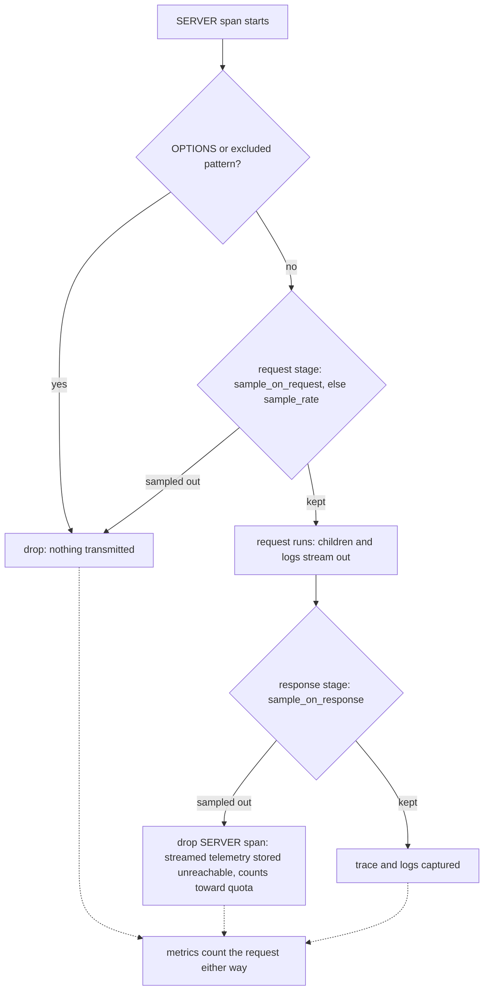

# Request Sampling - Plan

## Goal Capsule

- **Objective**: Make request sampling a first-class v1 feature under one capture-probability model: a static `sample_rate` plus `sample_on_request` / `sample_on_response` callbacks returning a keep probability, replacing the boolean `exclude_on_request` / `exclude_on_response` callbacks before v1 ships. SDK-only and silent toward the cloud; metrics count every request regardless.
- **Product authority**: This contract supersedes the anti-sampling posture in `v1/design.md` ("Sampling is never Apitally's mechanism", §2) for the sampling feature; the §3 single-drop-point architecture and everything else in the design docs stay authoritative. `v1/spec.md` remains the normative wire contract; its §6.5 amendment is part of this work (R15).
- **Open blockers**: None.

---

## Product Contract

### Summary

Users can capture a percentage of requests instead of all of them: a static `sample_rate` config parameter, refined per request by `sample_on_request` / `sample_on_response` callbacks that return a keep probability. Binary exclusion becomes the `0.0` edge of the same model, so the boolean `exclude_on_*` callbacks are removed. A sampled-out request loses its trace and logs; metrics always count everything.

### Problem Frame

The v1 design treated sampling as a threat to avoid because, at design time, request coverage depended on traces: a dropped SERVER span meant a lost request. That dependency is gone — the metrics pipeline is transport-sourced and fully span-independent (`apitally/shared/metrics.py`, pinned by `tests/test_asgi_transport.py`'s sampled-out-request test), so counts stay complete no matter what happens to traces.

That leaves high-traffic apps with no volume control except binary exclusion: capture every request's trace and logs, or none for a matched pattern. 0.x had only hard caps (a 100 rps deque) and server-driven suspension.

### Key Decisions

- **One capture-probability model, not sampling bolted next to exclusion.** Every request has a keep probability, default `1.0`. The boolean `exclude_on_*` callbacks answer the same question at the same two evaluation points, so they are deleted before they ever ship rather than kept alongside. Path/user-agent exclusion patterns are a different feature and stay.
- **Keep-probability polarity under `sample_*` names.** A float-returning `exclude_on_*` would read as exclusion probability, inverting the universal convention where a sample rate is a keep probability (Sentry, OTel, Datadog). The refactor ships with the rename; `1.0` always means "capture".
- **Processor-side drop, never an OTel sampler.** The sampling decision lives at the design.md §3 keep/drop point in `ApitallySpanProcessor`. Own-it-all mode keeps its explicit `ALWAYS_ON` sampler. This preserves the single-mechanism invariant, works identically in cooperative mode, and keeps the §5 ContextVar and `set_consumer` semantics intact for sampled-out requests.
- **Deterministic per trace, minimum across stages.** One trace-id-derived value (the `TraceIdRatioBased` convention) is tested against each stage's rate. Two Apitally-instrumented services sampling at the same rate capture the same traces instead of shredding cross-service traces with independent coin flips, and a request passing a 0.5 request-stage then a 0.5 response-stage keeps with probability 0.5 (the minimum), not 0.25.
- **SDK-only and silent.** The cloud is never told sampling happened; the request log is understood to be a subset of the metric counts when sampling is configured. No sampling metadata is transmitted and no cloud-side work is required.

### Requirements

**API surface**

- R1. New cross-framework kwarg `sample_rate: float`, default `1.0`, range `[0, 1]`: the fraction of non-excluded requests captured as traces with their logs. Also settable via `APITALLY_SAMPLE_RATE` under the design.md §14 precedence.
- R2. New kwargs `sample_on_request` and `sample_on_response`: callbacks receiving the SERVER span (`ReadableSpan`, matching today's callback signature) and returning a keep probability — a `float` in `[0, 1]`, a `bool` (`True` = always capture, `False` = never), or `None` to fall back to `sample_rate` for that request.
- R3. The boolean `exclude_on_request` / `exclude_on_response` kwargs are removed. `exclude_paths` and the default path/user-agent exclusion patterns are unchanged.
- R4. Invalid sampling config never breaks the app (design.md §9): an out-of-range `sample_rate` or unparseable env var warns once and captures everything; a raising or invalid-returning callback warns and counts as keep for that request.

**Sampling semantics**

- R5. The request-stage decision (`sample_on_request`, else `sample_rate`) is evaluated at SERVER span start. A request sampled out there transmits nothing: its spans and logs are dropped locally, the same guarantee `exclude_on_request` carried.
- R6. The response-stage decision (`sample_on_response`) is evaluated at SERVER span end. Dropping there abandons already-streamed descendants and logs as ingest orphans per spec §6.5: they are stored but never surfaced, identical to `exclude_on_response` today; the per-request buffer named in Scope Boundaries removes it in a follow-up PR.
- R7. The keep decision derives from the trace ID tested against the effective rate, deterministic per trace; the overall capture probability of a request is the minimum of its request-stage and response-stage rates.
- R8. Exclusion runs first: OPTIONS and pattern-excluded requests never reach sampling; sampling applies only to what survives.

**Signal interactions**

- R9. Metrics count every request regardless of sampling — the transport-sourced histogram path is untouched, and a test pins histogram and consumer-dimension completeness under `sample_rate=0.0` (mirroring the existing cooperative-sampler test).
- R10. Logs of a sampled-out request are dropped with the trace via the shared span map; the startup event is unaffected.
- R11. `set_consumer`, `set_request_attribute`, and `capture_exception` keep working on sampled-out requests: span writes stay local, and the consumer still reaches metrics through the request-scoped holder.
- R12. The cooperative-mode lossy-sampler warning is unchanged: it concerns coverage the user did not opt into via Apitally. The user's OTel sampler drops spans before our processor sees them, so Apitally's rate applies to what remains.

**Docs and cross-language**

- R13. `v1/design.md` §§2, 3, 5, 13, 14 are amended to reflect sampling as a feature; the README documents the three knobs; the migration guide maps 0.x `exclude_callback` to `sample_on_request` / `sample_on_response` with the polarity flip called out explicitly. User-facing docs state plainly that response-stage sampling cannot retroactively unsend a request's child spans and logs — those still count toward quota — making request-stage sampling the volume/quota lever and `sample_on_response` the keep-the-interesting-ones refinement.
- R14. Kwarg names and semantics are portable across future SDK languages per design.md §17 (`sampleRate` / `SampleRate` etc.); the capture-probability model is the cross-language contract, not a Python-only shape.
- R15. Spec §6.5 is amended so sampled-out requests join OPTIONS and excluded requests as permitted non-exports, keeping the orphan rule and §6.8 metrics independence as the ingest contract. The amendment lands in the cloud repo (spec.md's origin) and the `v1/spec.md` copy here is updated to match.

### Acceptance Examples

- AE1. **Covers R1, R9.** Given `sample_rate=0.1` and no callbacks, when 1,000 non-excluded requests arrive, then roughly 100 have traces and logs, and the duration histogram counts all 1,000.
- AE2. **Covers R2, R6.** Given `sample_on_response=lambda span: True if status(span) >= 500 else 0.05`, when requests complete, then every 5xx is captured, ~5% of healthy responses are captured, and the descendants of dropped healthy requests were exported, stored unreachable, and counted toward quota.
- AE3. **Covers R2, R5.** Given `sample_on_request` returning `0.01` for one noisy path and `None` otherwise, when traffic arrives, then the noisy path is captured at 1% with nothing transmitted for its sampled-out requests, and all other paths follow `sample_rate`.
- AE4. **Covers R7.** Given a request-stage rate of `0.5` and a response callback returning `0.5`, when the same trace ID is evaluated at both stages, then the two tests agree and the overall capture rate is 50%, not 25%.
- AE5. **Covers R2, R3.** Given `sample_on_request=lambda span: not is_bot(span)`, when a bot request arrives, then it is dropped with the request-stage no-transmission guarantee — binary exclusion expressed as the `0.0` edge of sampling.

### Scope Boundaries

- Transmitting sampling metadata to the cloud (labeling the request log as sampled, extrapolation) — a possible future spec change; v1 sampling is silent.
- Per-request buffering of descendants and logs until the response-stage decision — the designated mechanism for eliminating orphan egress and quota consumption (Sentry's transaction-envelope model, done as a holding layer in our processor before the batch export). Deferred to a follow-up PR. It composes with the API unchanged: `sample_on_response` semantics stay identical, the waste just disappears.
- Sampling of individual signals (logs-only or metrics sampling) — sampling governs the trace-plus-logs unit of a request; metrics are never sampled.

### Dependencies / Assumptions

- **Trace-ID randomness.** Deterministic sampling assumes uniformly random trace-ID bits — the same assumption OTel's `TraceIdRatioBased` makes; upstream systems generating non-random trace IDs skew effective rates.

### Outstanding Questions

**Deferred to planning**

- Exact hash/threshold mechanics for the trace-id decision (reuse OTel's `TraceIdRatioBased` bound computation vs a minimal local equivalent).
- Where the sampling evaluation sits inside `ApitallySpanProcessor.on_start` / `on_end` relative to the existing exclusion checks, and the config-validation details for R4.

### Sources

- `v1/spec.md` §6.5 (export MUST + orphan rule), §6.8 (exclusion counted in metrics), §7.1 (duration histogram as count anchor).
- `v1/design.md` §2 (anti-sampling posture, cooperative sampler warning), §3 (single drop point), §5 (callback surface, ContextVar caveats).
- `apitally/shared/span_processor.py` (keep/drop map, callback evaluation points), `apitally/shared/consumer.py` (request-scoped consumer holder), `apitally/shared/metrics.py` (span-independent recording).
- `tests/test_asgi_transport.py` (`test_sampled_out_request_still_records_metrics` — pins metrics completeness under a 0.0 sampler).
- Prior art: Sentry's `traces_sample_rate` + `traces_sampler` (static rate + probability-returning callback, bool accepted); OTel's `TraceIdRatioBased` (deterministic trace-id sampling convention).
