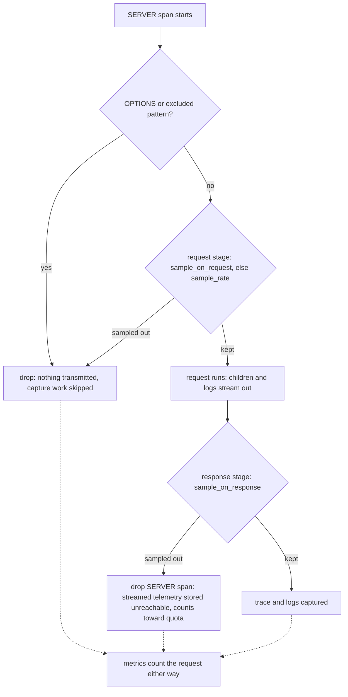
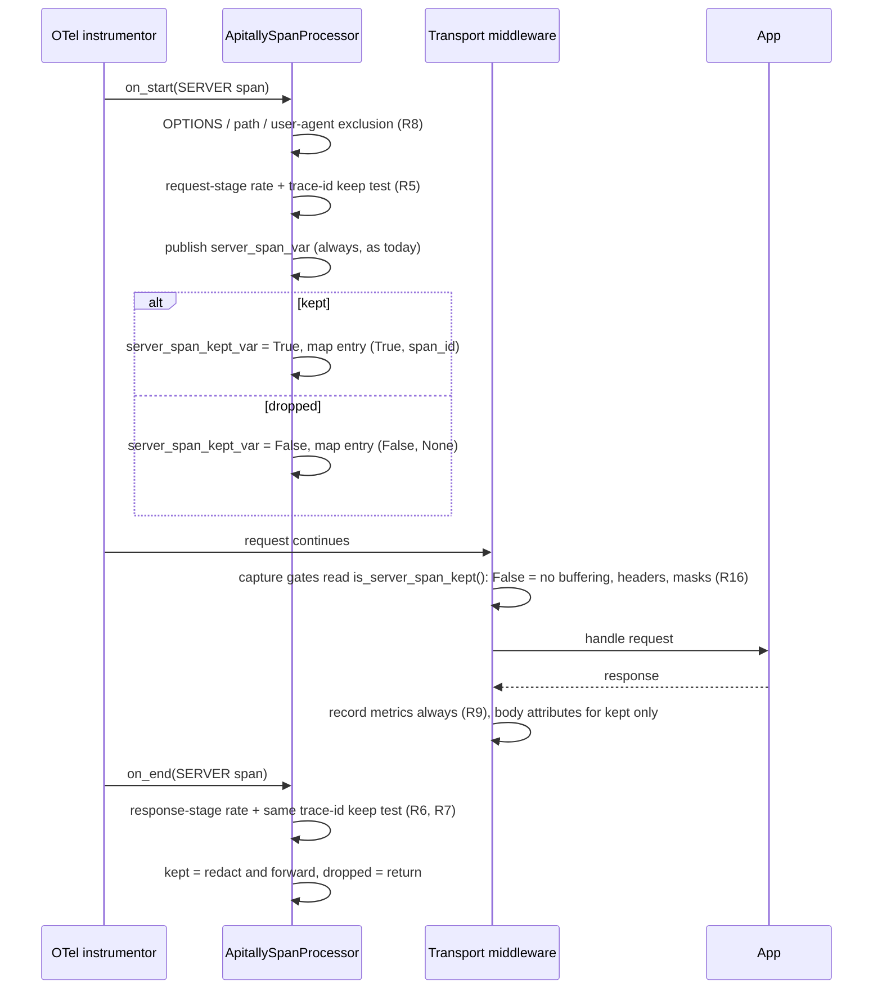

# Request Sampling - Plan

## Goal Capsule

- **Objective**: Make request sampling a first-class v1 feature under one capture-probability model: a static `sample_rate` plus `sample_on_request` / `sample_on_response` callbacks returning a keep probability, replacing the boolean `exclude_on_request` / `exclude_on_response` callbacks before v1 ships. SDK-only and silent toward the cloud; metrics count every request regardless.
- **Product authority**: This contract supersedes the anti-sampling posture in `v1/design.md` ("Sampling is never Apitally's mechanism", §2) for the sampling feature; the §3 single-drop-point architecture and everything else in the design docs stay authoritative. `v1/spec.md` remains the normative wire contract; its §6.5 amendment is part of this work (R15).
- **Stop conditions**: Surface a blocker instead of guessing if implementation would contradict spec §6.5/§6.8 or force a Product Contract change beyond what the units describe.
- **Execution posture**: The "Code Style — binding for every unit" and "Test posture" sections of `v1/plan.md` apply unchanged to every unit in this plan — least code that does the job, modern 3.10+ Python, top-of-module imports, deliberate function order, no single-use helpers, sparse WHY-only comments; assertions against OTel-side data with no mocking of Apitally internals, and the per-unit test scenarios here are the intended set, not a floor to multiply into variants.
- **Open blockers**: None.

---

## Product Contract

### Summary

Users can capture a percentage of requests instead of all of them: a static `sample_rate` config parameter, refined per request by `sample_on_request` / `sample_on_response` callbacks that return a keep probability. Binary exclusion becomes the `0.0` edge of the same model, so the boolean `exclude_on_*` callbacks are removed. A sampled-out request loses its trace and logs; metrics always count everything.

### Problem Frame

The v1 design treated sampling as a threat to avoid because, at design time, request coverage depended on traces: a dropped SERVER span meant a lost request. That dependency is gone — the metrics pipeline is transport-sourced and fully span-independent (`apitally/shared/metrics.py`, pinned by `tests/test_asgi_transport.py`'s sampled-out-request test), so counts stay complete no matter what happens to traces.

That leaves high-traffic apps with no volume control except binary exclusion: capture every request's trace and logs, or none for a matched pattern. 0.x had only hard caps (a 100 rps deque) and server-driven suspension.

### Key Decisions

- **One capture-probability model, not sampling bolted next to exclusion.** Every request has a keep probability, default `1.0`. The boolean `exclude_on_*` callbacks answer the same question at the same two evaluation points, so they are deleted before they ever ship rather than kept alongside. Path/user-agent exclusion patterns are a different feature and stay.
- **Keep-probability polarity under `sample_*` names.** A float-returning `exclude_on_*` would read as exclusion probability, inverting the universal convention where a sample rate is a keep probability (Sentry, OTel, Datadog). The refactor ships with the rename; `1.0` always means "capture".
- **Processor-side drop, never an OTel sampler.** The sampling decision lives at the design.md §3 keep/drop point in `ApitallySpanProcessor`. Own-it-all mode keeps its explicit `ALWAYS_ON` sampler. This preserves the single-mechanism invariant, works identically in cooperative mode, and keeps the §5 ContextVar and `set_consumer` semantics intact for sampled-out requests.
- **Deterministic per trace, minimum across stages.** One trace-id-derived value (the `TraceIdRatioBased` convention) is tested against each stage's rate. Two Apitally-instrumented services sampling at the same rate capture the same traces instead of shredding cross-service traces with independent coin flips, and a request passing a 0.5 request-stage then a 0.5 response-stage keeps with probability 0.5 (the minimum), not 0.25.
- **SDK-only and silent.** The cloud is never told sampling happened; the request log is understood to be a subset of the metric counts when sampling is configured. No sampling metadata is transmitted and no cloud-side work is required.

### Requirements

**API surface**

- R1. New cross-framework kwarg `sample_rate: float`, default `1.0`, range `[0, 1]`: the fraction of non-excluded requests captured as traces with their logs. Kwarg only — no `APITALLY_SAMPLE_RATE` env var.
- R2. New kwargs `sample_on_request` and `sample_on_response`: callbacks receiving the SERVER span (`ReadableSpan`, matching today's callback signature) and returning a keep probability — a `float` in `[0, 1]`, a `bool` (`True` = always capture, `False` = never), or `None` to abstain: `sample_on_request` returning `None` falls back to `sample_rate`, while `sample_on_response` returning `None` leaves the request-stage decision standing.
- R3. The boolean `exclude_on_request` / `exclude_on_response` kwargs are removed. `exclude_paths` and the default path/user-agent exclusion patterns are unchanged.
- R4. Invalid sampling config never breaks the app (design.md §9): a non-numeric or out-of-range `sample_rate` warns once and captures everything; a raising or invalid-returning callback warns and counts as keep for that request.

**Sampling semantics**

- R5. The request-stage decision (`sample_on_request`, else `sample_rate`) is evaluated at SERVER span start. A request sampled out there transmits nothing: its spans and logs are dropped locally, the same guarantee `exclude_on_request` carried.
- R6. The response-stage decision (`sample_on_response`) is evaluated at SERVER span end. Dropping there abandons already-streamed descendants and logs as ingest orphans per spec §6.5: they are stored but never surfaced, identical to `exclude_on_response` today; the per-request buffer named in Scope Boundaries removes it in a follow-up PR. *Superseded by `v1/buffering.md`: descendants and logs are now buffered until the decision, so a response-stage drop exports nothing and consumes no quota.*
- R7. The keep decision derives from the trace ID tested against the effective rate, deterministic per trace; the overall capture probability of a request is the minimum of its request-stage and response-stage rates.
- R8. Exclusion runs first: OPTIONS and pattern-excluded requests never reach sampling; sampling applies only to what survives.
- R16. A request dropped at the request stage (exclusion or request-stage sampling) skips capture work in the transport middleware: no body buffering, no header or body attribute writes, no mask callback invocations. This extends to pattern-excluded requests, which today pay full capture cost despite never exporting. Response-stage sampling cannot skip capture — the body has already streamed when that decision runs.

**Signal interactions**

- R9. Metrics count every request regardless of sampling — the transport-sourced histogram path is untouched, and a test pins histogram and consumer-dimension completeness under `sample_rate=0.0` (mirroring the existing cooperative-sampler test).
- R10. Logs of a sampled-out request are dropped with the trace via the shared span map; the startup event is unaffected.
- R11. `set_consumer`, `set_request_attribute`, and `capture_exception` keep working on sampled-out requests: span writes stay local on a span that never exports, and the consumer reaches metrics through the request-scoped holder with the sync-endpoint span-attribute fallback intact (design.md §5).
- R12. The cooperative-mode lossy-sampler warning is unchanged: it concerns coverage the user did not opt into via Apitally. The user's OTel sampler drops spans before our processor sees them, so Apitally's rate applies to what remains.

**Docs and cross-language**

- R13. `v1/design.md` §§2, 3, 5, 13 are amended to reflect sampling as a feature; the README documents the three knobs; the migration guide maps 0.x `exclude_callback` to `sample_on_request` / `sample_on_response` with the polarity flip called out explicitly. User-facing docs state plainly that response-stage sampling cannot retroactively unsend a request's child spans and logs — those still count toward quota — making request-stage sampling the volume/quota lever and `sample_on_response` the keep-the-interesting-ones refinement.
- R14. Kwarg names and semantics are portable across future SDK languages per design.md §17 (`sampleRate` / `SampleRate` etc.); the capture-probability model is the cross-language contract, not a Python-only shape.
- R15. Spec §6.5 is amended so sampled-out requests join OPTIONS and excluded requests as permitted non-exports, keeping the orphan rule and §6.8 metrics independence as the ingest contract. The amendment lands in the cloud repo (spec.md's origin) and the `v1/spec.md` copy here is updated to match.

### Acceptance Examples

- AE1. **Covers R1, R9.** Given `sample_rate=0.1` and no callbacks, when 1,000 non-excluded requests arrive, then exactly those whose trace IDs fall under the 0.1 bound (~10% by construction) have traces and logs, and the duration histogram counts all 1,000.
- AE2. **Covers R2, R6.** Given `sample_on_response=lambda span: True if status(span) >= 500 else 0.05`, when requests complete, then every 5xx is captured, ~5% of healthy responses are captured, and the descendants of dropped healthy requests were exported, stored unreachable, and counted toward quota. *Superseded by `v1/buffering.md` AE1: dropped healthy requests now export nothing.*
- AE3. **Covers R2, R5.** Given `sample_on_request` returning `0.01` for one noisy path and `None` otherwise, when traffic arrives, then the noisy path is captured at 1% with nothing transmitted for its sampled-out requests, and all other paths follow `sample_rate`.
- AE4. **Covers R7.** Given a request-stage rate of `0.5` and a response callback returning `0.5`, when the same trace ID is evaluated at both stages, then the two tests agree and the overall capture rate is 50%, not 25%.
- AE5. **Covers R2, R3.** Given `sample_on_request=lambda span: not is_bot(span)`, when a bot request arrives, then it is dropped with the request-stage no-transmission guarantee — binary exclusion expressed as the `0.0` edge of sampling.
- AE6. **Covers R16.** Given `log_request_body=True` and a request sampled out at the request stage, when the request completes, then the body was never buffered and `mask_request_body` was never invoked, while the duration histogram still counts the request.

### Scope Boundaries

- Transmitting sampling metadata to the cloud (labeling the request log as sampled, extrapolation) — a possible future spec change; v1 sampling is silent.
- Per-request buffering of descendants and logs until the response-stage decision — the designated mechanism for eliminating orphan egress and quota consumption (Sentry's transaction-envelope model, done as a holding layer in our processor before the batch export). Deferred to a follow-up PR. It composes with the API unchanged: `sample_on_response` semantics stay identical, the waste just disappears. *Delivered by `v1/buffering.md`.*
- Sampling of individual signals (logs-only or metrics sampling) — sampling governs the trace-plus-logs unit of a request; metrics are never sampled.

### Dependencies / Assumptions

- **Trace-ID randomness.** Deterministic sampling assumes uniformly random trace-ID bits — the same assumption OTel's `TraceIdRatioBased` makes; upstream systems generating non-random trace IDs skew effective rates.
- **Cloud spec mirror.** R15's amendment must also land in the cloud repo, where `spec.md` originates; that edit happens outside this repository and is tracked in the Definition of Done as a handoff.

---

## Planning Contract

Product Contract preservation: changed — R16 and AE6 added and R11 amended (user-requested capture short-circuit); R2 amended (response-stage `None` abstains instead of re-testing `sample_rate`); all other R/AE text carried unchanged from the brainstorm.

### Key Technical Decisions

- KTD1. **Reuse `TraceIdRatioBased.get_bound_for_rate`, never the sampler class.** The installed opentelemetry-sdk (1.43.0, floor `>=1.43.0` in `pyproject.toml`) exposes the bound computation as a classmethod: keep iff `trace_id & ((1 << 64) - 1) < get_bound_for_rate(rate)`, i.e. the low 64 bits of the trace ID against `round(rate * 2**64)`. Rate `1.0` yields bound `2**64` (always keep), `0.0` yields `0` (never keep). Constructing `TraceIdRatioBased` itself is forbidden here — its `__init__` raises `ValueError` on out-of-range rates, which conflicts with R4's never-break rule; rates are validated before the comparison. The bound for the static `sample_rate` is computed once at processor construction — config is immutable after configure (v1/plan.md §8) — while callback-resolved rates compute their bound per request. The class is already imported in `apitally/shared/providers.py`, so this adds no dependency.
- KTD2. **Both stages slot into the existing decision points; one rate resolver replaces `callback_excludes`.** Request stage: the `callback_excludes(config.exclude_on_request, ...)` tail of `exclude_request` in `apitally/shared/span_processor.py` becomes rate resolution plus the trace-id keep test, after the OPTIONS/path/user-agent checks (R8). Response stage: the `exclude_on_response` branch in `on_end` becomes the same helper with `sample_on_response`, evaluated only when that callback is configured — an unconfigured response stage means no second decision. The resolver maps a callback result to an effective rate: `bool` to `1.0`/`0.0`, `float` as-is; `None` abstains per R2 — falling back to `sample_rate` at the request stage, keeping the request-stage decision at the response stage; a raising or invalid-returning callback warns and resolves to keep (R4), mirroring the existing never-raise wrapper. R7's minimum composition is emergent, not computed: both stages test the same trace-id value, so the request survives both iff it falls under the smaller bound.
- KTD3. **Capture short-circuit via a keep-flag ContextVar (R16).** `server_span_var` stays published unconditionally exactly as today: reused WSGI worker threads need each request to overwrite the previous span, and sync endpoints (anyio copied contexts) rely on the span object to carry `set_consumer`'s identifier to metrics — keep-gating publication would ship stale-span misattribution and sever that channel. Instead `on_start` sets a new `server_span_kept_var` ContextVar (accessor `is_server_span_kept()`) for every SERVER local root, `True` on keep and `False` on drop, and the transports gate header/body attribute writes and the `capture_request` / `capture_response` buffering flags on the flag plus the existing live-recording-span checks. The flag applies in both provider modes; a cooperative user-sampler-dropped request never fires `on_start`, and the existing `is_recording()` gates keep stale prior-request state inert.
- KTD4. **Warn-once validation mirrors the providers.py flag pattern.** A non-numeric or out-of-range `sample_rate` kwarg warns once via a module-level flag (reset in `config.reset()`, matching `providers.reset()` and the conftest autouse fixtures) and resolves to `1.0`. A naive warning in `resolve_config` would repeat on every `configure()` call, hence the flag.
- KTD5. **Adapter signatures declare `sample_rate: float | None = None`, never `= 1.0`.** `explicit_kwargs` (`apitally/shared/config.py`) drops `None` values so an absent kwarg genuinely means "not specified" — the dataclass default applies and the §8 re-call equality check sees only what the user actually passed, matching every other kwarg's pattern. Only six adapters carry the kwarg list — `apitally/django_ninja.py` and `apitally/django_rest_framework.py` re-export Django's `init_apitally` and need no change.
- KTD6. **Sampling tests are deterministic, never statistical.** Fixed trace IDs via remote-parent `SpanContext(trace_id=..., is_remote=True)` (existing pattern in `tests/test_span_processor.py`) or an injected id generator, asserting exact keep/drop for IDs chosen just below and above the bound. AE1's "roughly 100 of 1,000" is pinned as bound math on chosen IDs, not a ratio assertion over random IDs.

### High-Level Technical Design

Where the two decisions sit relative to the middleware, and how the short-circuit propagates:

Cooperative mode composes without special cases: a user-sampler-dropped request never fires `on_start`, so neither ContextVar is set for it and the existing `is_recording()` gates keep any stale prior-request state inert; Apitally's rate governs only the spans that reach the processor (R12).

---

## Implementation Units

### U1. Config surface: sampling fields replace the exclude callbacks

- **Goal:** `ApitallyConfig` carries `sample_rate`, `sample_on_request`, `sample_on_response` with never-break validation; `exclude_on_request` / `exclude_on_response` fields are gone.
- **Requirements:** R1, R2, R3, R4, R14.
- **Dependencies:** None.
- **Files:** `apitally/shared/config.py`, `tests/test_config.py`.
- **Approach:** Add `sample_rate: float = 1.0` and the two callback fields typed `Callable[[ReadableSpan], float | bool | None] | None`; remove the exclude fields (`CONFIG_FIELDS` auto-derives from the dataclass, so `explicit_kwargs` follows). No env var for any of the three. Validate the kwarg type-then-range in `resolve_config` with the KTD4 warn-once flag, resolving any non-numeric or out-of-range value to `1.0` — a bare range comparison on a string kwarg would raise at startup, exactly what R4 forbids.
- **Patterns to follow:** `providers.py` warn-once flags, `config.reset()` test hygiene.
- **Test scenarios:**
  - Covers R1. `sample_rate=0.3` lands in the resolved config; default is `1.0` when the kwarg is absent.
  - Covers R4. Kwargs `1.5`, `-0.1`, and the string `"0.5"` each warn once across two `configure()` calls (single log record) and resolve to `1.0`.
  - `sample_rate=0.0` is accepted as a valid value, not treated as falsy/absent.
- **Verification:** `tests/test_config.py` green; `make check` clean.

### U2. Span processor: deterministic two-stage sampling decision

- **Goal:** The processor makes the request-stage and response-stage keep decisions from the trace ID, records the outcome in a request-scoped keep flag, and drops the exclude-callback machinery.
- **Requirements:** R2, R4, R5, R6, R7, R8, R10, R16 (keep-flag half).
- **Dependencies:** U1.
- **Files:** `apitally/shared/span_processor.py`, `tests/test_span_processor.py`.
- **Approach:** Replace `callback_excludes` with the KTD2 rate resolver plus the KTD1 keep test. In `on_start`, publish `server_span_var` unconditionally as today, run exclusion checks, then the request-stage decision, and set `server_span_kept_var` to the outcome (KTD3). In `on_end`, evaluate `sample_on_response` (when configured) through the same resolver and keep test before redact-and-forward; `None` abstains per R2. Log drop propagation (R10) needs no new code — the `(False, None)` map entry already starves `resolve_server_span_id`.
- **Test scenarios:**
  - Covers R5, R7. With `sample_rate=0.5`, a trace ID just below the bound is kept and one just above is dropped, deterministically (fixed remote-parent trace IDs per KTD6).
  - Covers AE5, R2. `sample_on_request` returning `False` drops with nothing forwarded; returning `True` keeps despite `sample_rate=0.0`.
  - Covers AE3, R2. `sample_on_request` returning `0.01` for one path and `None` otherwise: the `None` path follows `sample_rate`, verified with trace IDs on both sides of each bound.
  - Covers R8. A pattern-excluded path never invokes `sample_on_request` (callback spy).
  - Covers R4. A raising `sample_on_request` warns and keeps; a callback returning an invalid type (e.g. a string) warns and keeps. The warning text replaces the old pin in `test_raising_exclude_on_request_warns_and_keeps`.
  - Covers AE2, R6. `sample_on_response` returning `True` for 5xx keeps every 5xx; returning a low float drops matching healthy responses at span end, after descendants already forwarded.
  - Covers AE4, R7. With request-stage `0.5` and response callback `0.5`, the same trace ID gets the same verdict at both stages — kept requests survive both, no double attrition.
  - Covers R2. Boost-then-abstain: a request kept by `sample_on_request` returning `True` under `sample_rate=0.1` stays kept when `sample_on_response` returns `None` — response-stage abstention never re-tests `sample_rate`.
  - Covers R16, R10. For a request-stage-dropped request, `is_server_span_kept()` is `False` and `resolve_server_span_id` returns `None` while `get_server_span()` still returns the span; for a kept request the flag is `True` and both resolve.
  - Covers R16. Two sequential requests in the same context, kept then dropped: the dropped request reads its own `False` flag and no stale consumer from the kept request — pins the reused-worker-thread hazard of keep-gating publication.
- **Verification:** `tests/test_span_processor.py` green including the rewritten exclude-callback tests; no `exclude_on_*` references remain in the module.

### U3. Transports: capture short-circuit and metrics completeness

- **Goal:** Request-stage-dropped requests skip body buffering, header/body attribute writes, and mask callbacks in both transports, while metrics stay complete.
- **Requirements:** R9, R11, R16.
- **Dependencies:** U2.
- **Files:** `apitally/shared/asgi.py`, `apitally/shared/wsgi.py`, `tests/test_asgi_transport.py`, `tests/test_wsgi_transport.py`.
- **Approach:** Gate `capture_request` / `capture_response` and the header/body attribute writes on `is_server_span_kept()`, in addition to the existing config, content-type, and `is_recording()` checks; the metrics path is untouched. Size fallback already handles skipped buffering: `record_request` falls back to the `Content-Length` header exactly as when body logging is off. WSGI mirrors the gating, but its capture path has no existing span check to extend — the flag lookup is added fresh, not copy-pasted from the ASGI diff.
- **Operational note:** R16 changes observable behavior for `exclude_paths` users too — excluded requests stop paying capture cost, and in cooperative mode both excluded and sampled-out requests stop receiving Apitally-written header/body attributes on spans the user's own pipeline exports. Call both out in the PR description.
- **Test scenarios:**
  - Covers AE6, R16. `sample_rate=0.0` with `log_request_body=True`: `mask_request_body` is never invoked, no spans are exported, and the receive stream passes through unwrapped (no buffering).
  - Covers R9, AE1, R12. Under `sample_rate=0.0` the duration histogram records the request with its consumer dimension — the Apitally-sampling twin of the existing `test_sampled_out_request_still_records_metrics`, which stays green and keeps pinning the cooperative-sampler half.
  - Covers R11. `set_consumer` during a sampled-out request still lands the consumer in metrics — including on a sync (threadpool) endpoint, where the copied context loses the ContextVar write and the span-attribute fallback carries it.
  - Regression guard: with `sample_rate=1.0` and body logging on, body capture and masking behave exactly as today.
- **Verification:** Both transport test files green; no behavior change for kept requests.

### U4. Adapters: kwarg swap across the six signatures

- **Goal:** Every framework entry point exposes the sampling kwargs and no longer accepts the exclude callbacks.
- **Requirements:** R1, R2, R3, R14.
- **Dependencies:** U1.
- **Files:** `apitally/fastapi.py`, `apitally/starlette.py`, `apitally/flask.py`, `apitally/blacksheep.py`, `apitally/django.py`, `apitally/litestar.py`, `tests/test_fastapi.py`.
- **Approach:** Replace `exclude_on_request` / `exclude_on_response` with `sample_rate: float | None = None`, `sample_on_request`, `sample_on_response` in each signature (KTD5); `explicit_kwargs` picks the new names up from the dataclass with no further plumbing. `django_ninja.py` and `django_rest_framework.py` re-export and are untouched.
- **Test scenarios:**
  - Covers R1 end-to-end. One representative test in `tests/test_fastapi.py`: `init_apitally(app, sample_rate=0.0, ...)` exports no request spans while metrics record the request — pins the adapter-to-config plumbing through a real framework.
  - Remaining coverage: existing framework suites in the CI matrix; the swap is mechanical.
- **Verification:** Full framework matrix green (`make test` locally, CI matrix on push).

### U5. Docs: README, migration guide, design doc

- **Goal:** User-facing and internal docs describe sampling as the feature it now is, with the polarity flip and quota semantics stated plainly.
- **Requirements:** R13.
- **Dependencies:** U1–U4 (documents the final shape).
- **Files:** `README.md`, `MIGRATION.md`, `v1/design.md`, `v1/plan.md`.
- **Approach:** README Configuration section gains `sample_rate` and a pointer to the callbacks. MIGRATION.md: rewrite the `exclude_callback` mapping row and the "Excluding requests" section to the sampling API, calling out the polarity flip (return keep, not exclude). `v1/design.md` §§2, 3, 5, 13: sampling as a feature, config table rows, and the R13 framing — request-stage sampling is the volume/quota lever (and skips capture overhead per R16), `sample_on_response` the keep-the-interesting-ones refinement that cannot unsend already-streamed telemetry; note the cooperative-mode visibility change — excluded and sampled-out requests no longer carry Apitally-written header/body attributes on spans the user's own pipeline exports. `v1/plan.md` references to the exclude callbacks are updated for consistency; `v1/review-*.md` stay untouched as historical records.
- **Test scenarios:** Test expectation: none — documentation.
- **Verification:** Grep for `exclude_on_request` / `exclude_on_response` returns hits only in `v1/review-*.md` and `v1/sampling.md`.

### U6. Spec §6.5 amendment

- **Goal:** The spec permits sampled-out requests as non-exports, keeping the orphan rule and metrics independence intact.
- **Requirements:** R15.
- **Dependencies:** None (can land alongside the code).
- **Files:** `v1/spec.md`.
- **Approach:** Amend §6.5 so sampled-out requests join OPTIONS and excluded requests as permitted non-exports; the upstream-sampling prohibition (§6.5) and metrics-count-everything rule (§6.8) stay as written. Update the §11 cross-option renames note that still cites `exclude_on_request` / `exclude_on_response`. The canonical spec lives in the cloud repo; mirror the identical amendment there (tracked in Definition of Done as a handoff, since that edit is outside this repository).
- **Test scenarios:** Test expectation: none — spec document.
- **Verification:** `v1/spec.md` §6.5 and §11 consistent with R15; cloud-repo mirror created or explicitly handed off.

---

## Verification Contract

| Gate | Command | Applies to |
|---|---|---|
| Test suite | `make test` (`uv run pytest -v --tb=short`) | U1–U4 |
| Lint, format, types, lockfile | `make check` (ruff check, ruff format --diff, ty check, `uv lock --locked`) | All units |
| Coverage | `make test-coverage` | CI |
| Framework matrix | CI workflow (`.github/workflows/tests.yaml`) per-framework jobs | U4 |
| Removal sweep | `grep -rn "exclude_on_request\|exclude_on_response"` hits only `v1/review-*.md` and `v1/sampling.md` | U1–U6 |

The new tests named in U1–U4 are the proof of the plan: deterministic bound tests (KTD6), the warn-once pins, the capture short-circuit assertions, and the metrics-completeness twin.

---

## Definition of Done

- R1–R16 implemented and traced through U1–U6; AE1–AE6 realized as the deterministic tests named in the units.
- The diff holds `v1/plan.md`'s Code Style and Test posture: every new test pins a spec MUST, a design decision, or a real regression risk — no padding, no implementation-restating tests.
- `make test` and `make check` pass locally; the CI framework matrix is green.
- No `exclude_on_request` / `exclude_on_response` references remain outside `v1/review-*.md` and `v1/sampling.md`.
- `README.md`, `MIGRATION.md`, `v1/design.md`, `v1/plan.md`, and `v1/spec.md` updated; the cloud-repo spec amendment is mirrored or explicitly handed off with the exact §6.5 wording.
- No dead-end or abandoned-attempt code remains in the diff.

---

## Sources

- `v1/spec.md` §6.5 (export MUST + orphan rule), §6.8 (exclusion counted in metrics), §7.1 (duration histogram as count anchor).
- `v1/design.md` §2 (anti-sampling posture, cooperative sampler warning), §3 (single drop point), §5 (callback surface, ContextVar caveats), §14 (config precedence).
- `apitally/shared/span_processor.py` (keep/drop map, callback evaluation points, `server_span_var` publication), `apitally/shared/config.py` (`explicit_kwargs` None-filter, `resolve_config` env precedence), `apitally/shared/asgi.py` / `apitally/shared/wsgi.py` (capture gates, span-independent metrics recording), `apitally/shared/consumer.py` (request-scoped consumer holder), `apitally/shared/providers.py` (warn-once flag pattern, existing `TraceIdRatioBased` import).
- opentelemetry-sdk 1.43.0 `opentelemetry/sdk/trace/sampling.py` (`TraceIdRatioBased.get_bound_for_rate`, low-64-bit comparison, constructor raises on out-of-range).
- `tests/test_span_processor.py` (SERVER-span simulation fixtures, remote-parent trace-id pattern, exclude-callback tests to rewrite), `tests/test_asgi_transport.py` (`test_sampled_out_request_still_records_metrics`), `tests/test_config.py` (env precedence pins), `tests/conftest.py` (reset fixtures).
- Prior art: Sentry's `traces_sample_rate` + `traces_sampler` (static rate + probability-returning callback, bool accepted); OTel's `TraceIdRatioBased` (deterministic trace-id sampling convention).
